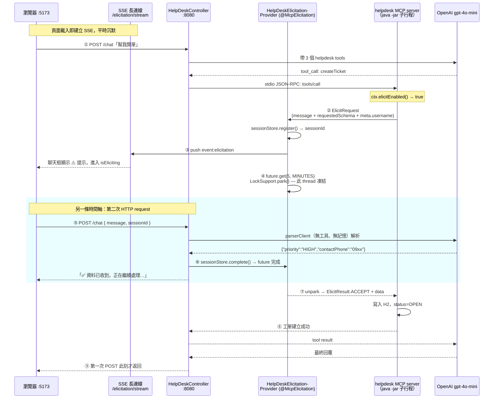
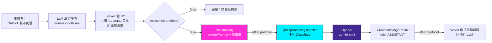
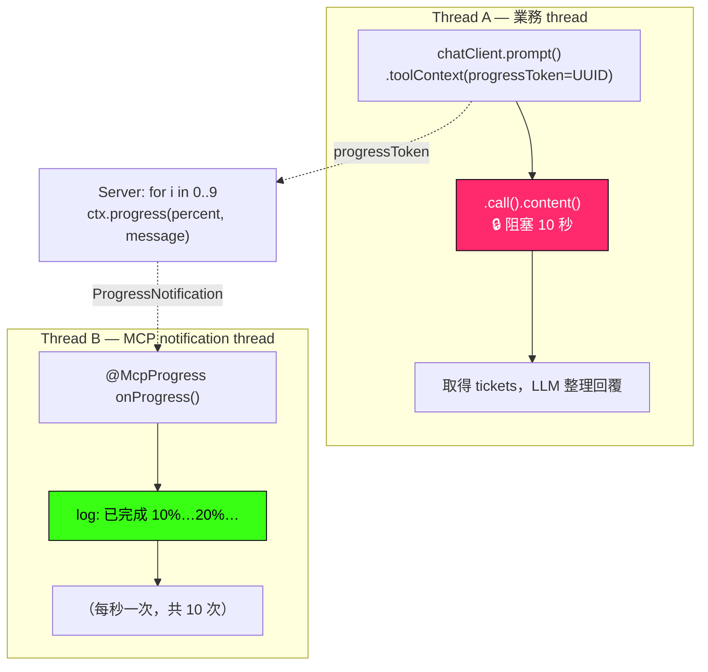
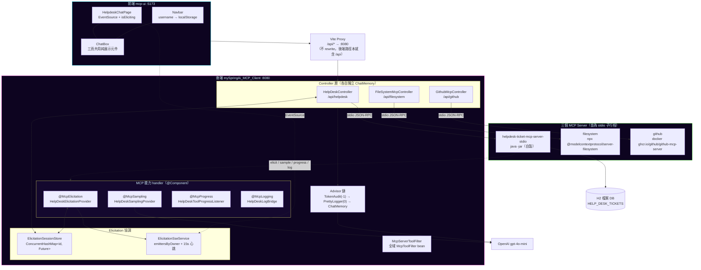

# mySpringAi_mcpClientApp_stdio — Spring AI × MCP over stdio 全端展示專案

> **Java 25 × Spring Boot 4.1 × Spring AI 2.0** 打造的 Model Context Protocol 實作範本 — 一個自製 MCP Server、一個同時串三個 MCP Server 的 Client、一個 React SPA，把 **Elicitation／Progress／Sampling／Logging** 四種 MCP 能力從協定層一路接到瀏覽器聊天框。

<p>
  
  
  
  
  
</p>
<p>
  
  
  
  
</p>
<p>
  
  
  
  
</p>

**24 小時不打烊、不用排隊、對答如流的智慧客服——就在一個聊天視窗裡。**

想像你是深夜遇到系統問題的使用者。過去，你只能填一張冷冰冰的工單表格，勾選下拉選單、填聯絡電話、寫問題描述，然後等隔天上班的客服回覆。現在，打開瀏覽器，對著聊天框說：

> 「我 Outlook 收不到新郵件，但網頁版可以正常收信。」

**AI Help Desk 客服**會在同一個對話框裡：

- 🧠 **像資深客服一樣先幫你自助排障** —— 從歷史已結案工單庫比對類似案例，回你一份具體的排除步驟（**Sampling**：Server 反過來借用 Client 的 LLM）
- ❓ **執行到一半發現缺資料，暫停對話反問你** —— 「請問急迫程度？聯絡電話是？」——建單流程**不中斷、不重來**，補完資料後工具從剛才停下的地方繼續（**Elicitation**）
- 📊 **執行中隨時回報進度** —— 「查詢中… 30%… 60%… 完成」，讓使用者知道系統沒卡死（**Progress**）
- 🎫 **問完直接幫你開工單存進資料庫**，並回傳工單編號

**這個 repo 的重點不在業務複雜度，而在「把 MCP 協定的四種進階能力真的接到底」** —— 不是 tool calling 的 hello world，而是跨 thread、跨 HTTP request、跨行程的完整協調：

| 對照維度 | 一般 Tool Calling 範例 | 本專案 |
|---|---|---|
| 溝通方向 | Client → Server 單向呼叫 | **雙向**：Server 執行中可反向要資料（elicit）、要 LLM（sample） |
| Tool 執行 | 一次呼叫、一次返回 | 執行中**暫停等人回答**，`CompletableFuture` 跨兩條 HTTP request 協調 |
| LLM 歸屬 | Server 自帶 API key | Server **不持有任何金鑰**，透過 sampling 借 Client 的 LLM |
| 進度回饋 | 無，只能等 | `ctx.progress()` 逐步推送，與阻塞中的 `.call()` 並行 |
| MCP Server 數量 | 一個 | **三個**同時連線（自製 JAR / npx / docker），工具分派到不同端點 |

| 子專案 | Port | 定位 |
|---|---|---|
| [`mySpringAi_MCP_Server_stdio`](./mySpringAi_MCP_Server_stdio) | 無（stdio 子行程） | MCP **Server** — Help Desk 工單，三個 `@McpTool` 各示範一種 MCP 能力 |
| [`mySpringAi_MCP_Client`](./mySpringAi_MCP_Client) | **8080** | MCP **Client** + REST/SSE 後端 — 同時連三個 MCP servers，包裝成 HTTP 端點 |
| [`mcp-ui`](./mcp-ui) | **5173** | React 19 + Vite 8 前端 — Cyberpunk 主題 SPA，三個聊天頁 |

> 本專案以學習與實驗為目的。部分設定（空密碼 H2、`ddl-auto=update`、無版本鎖定的 docker image、寬鬆的 SSE 身分辨識）僅適用本機，**不可直接用於正式環境** — 完整清單見 [已知的刻意取捨](#已知的刻意取捨)。
> 遇到問題？ → [疑難排解](#疑難排解)

---

## 目錄

1. [視覺展示](#1-視覺展示)
2. [系統架構與專案結構](#2-系統架構與專案結構)
3. [核心功能與亮點](#3-核心功能與亮點)
4. [技術棧](#4-技術棧)
5. [快速開始與本地部署](#5-快速開始與本地部署)
6. [附錄](#6-附錄)

---

## 1. 視覺展示

### 一次建單的完整旅程 —— Elicitation

這是整個 codebase 最微妙的一段：**一次 tool call 橫跨兩條 HTTP request、三個行程、四條 thread**。使用者只覺得「AI 問了我一句話」，底層卻是 MCP server 子行程把自己 park 在那裡等答案。



> 📌 **關鍵在第 ④ 步與第 ⑤ 步是不同的 thread。** `@McpElicitation` handler 阻塞在 `CompletableFuture.get()`，佔著一條 thread 什麼都不做；使用者的答案由 Tomcat 另外分派的 thread 送達並 `complete()` 那個 future。兩端的 `request-timeout` 都必須設 `300s`，與 `future.get(5, MINUTES)` 對齊 —— 少調一邊，5 分鐘內使用者慢慢打字就會被協定層先掐斷。

### Sampling —— Server 沒有 API key，卻能用 LLM

`troubleshootIssue` 展示 MCP 最反直覺的一條：**方向反過來**。Server 不呼叫 LLM，它把「請幫我想」這件事委託回 Client。



> 📌 **`@McpSampling` handler 注入的是 `ChatModel`，不是 `ChatClient`。** `ChatClient` 已經綁了 MCP tools —— 若用它，被 sample 出來的回應可能又觸發一次 tool call，而那個 tool 自己又會 sampling → 無限迴圈。`ChatModel` 是不帶任何工具的純 LLM 呼叫層。

### Progress —— 阻塞與回報同時進行

`getTicketStatus` 內含一段 10 秒的模擬耗時流程，每秒推一次進度。重點不在進度本身，而在**兩條 thread 並行**：



> 📌 **只有 `HelpDeskController` 在 `toolContext` 放了 `progressToken`**，所以只有它收得到進度。filesystem / github 兩個 controller 沒放，即使 server 想回報也無從對應。

### 畫面導覽

> ⚠️ 本 repo **未內含畫面截圖**（`docs/screenshots/` 不存在）。以下為各頁的實際行為描述，啟動後即可對照。

**Navbar（三頁共用）** — Cyberpunk 霓虹網格主題（`--bg-void #05010d`、`--neon-cyan #00f0ff`、`--neon-magenta #ff2bd6`，等寬字體）。右上角是 username 輸入框，**首次進站強制要求輸入**（`editing` 初值為 `!username`），值存進 `localStorage` 的 `mcp-username`。這個字串同時是三件事的 key：chat memory 的 `conversationId`、SSE 連線的 owner、以及 elicitation session 的所有權驗證。

**智能工單系統 demo**（`/helpdesk-chat`，預設首頁）— 唯一有 SSE 的頁面，頁首右側有 **SSE 狀態指示燈**，四種狀態：`未連線 / 連線中... / 已連線 / 連線中斷，重試中...`。**指示燈不是裝飾** —— `disabled={!username || sseStatus !== "connected"}`，SSE 沒接上就送不出訊息，因為 elicitation 的追問只能靠這條通道推回來。進入 elicitation 時，`allowSendWhileLoading` 讓輸入框在 `isLoading=true` 的情況下依然可用（原本那次 POST 還沒返回），並額外顯示一顆「取消」按鈕。

**FileSystem 工具 demo**（`/filesystem-chat`）與 **GitHub 工具 demo**（`/github-chat`）— 單純的 request/response，沒有 SSE 也沒有 elicitation。system prompt 裡寫死了範圍限制：filesystem 只能操作授權根目錄（預設桌面 `mymcp`）、GitHub 只能操作 `tonysk0210/mymcp`，且兩者都明文禁止不可復原的刪除操作。

---

## 2. 系統架構與專案結構

### 全景架構圖



Client 同時扮演兩個角色：**對前端**是 Web MVC + SSE 後端；**對 MCP** 是 host，以 stdio 拉起三個子行程並在它們之間分派工具。

### 三個 Controller、三套隔離

每個 controller 是一組固定的「工具集 ＋ system prompt ＋ 獨立記憶體」組合：

| Controller | 端點 | 工具來源（`ToolUtil` hint） | 獨立 ChatMemory | progressToken | Elicitation |
|---|---|---|---|---|---|
| `HelpDeskController` | `/api/helpdesk/**` | `"mySpringAi_MCP_Server_stdio"` | ✅ | ✅ | ✅ |
| `FileSystemMcpController` | `/api/filesystem/chat` | `"filesystem"` | ✅ | ❌ | ❌ |
| `GithubMcpController` | `/api/github/chat` | `"github"` | ✅ | ❌ | ❌ |

> ⚠️ **`HelpDeskController` 比對的是 `"mySpringAi_MCP_Server_stdio"`，不是 connection key `helpdesk-ticket-mcp-server-stdio`。** 前者是 server 在 MCP initialize 回應中自報的名稱（來自 server 的 `spring.ai.mcp.server.name`），後者是 client 端 properties 的連線鍵。而 `@McpElicitation` / `@McpSampling` / `@McpProgress` / `@McpLogging` 的 `clients` 屬性用的**正好相反 —— 是 connection key**。這兩個名稱長得很像但來源完全不同，是本專案最容易踩錯的地方。

三個 controller 都持有**各自** `new` 出來的 `MessageWindowChatMemory` 與 `PrettyLoggerAdvisor`。即使 `username` 相同，helpdesk 的對話歷史也不會滲進 filesystem 頁。

### 四種 MCP 能力的接線位置

| MCP 能力 | Server 側呼叫 | Client 側 handler | 對應 tool |
|---|---|---|---|
| **Elicitation** | `ctx.elicit(spec, TicketContactInfo.class)` | `HelpDeskElicitationProvider` `@McpElicitation` | `createTicket` |
| **Progress** | `ctx.progress(spec)` ×10 | `HelpDeskToolProgressListener` `@McpProgress` | `getTicketStatus` |
| **Sampling** | `ctx.sample(spec)` | `HelpDeskSamplingProvider` `@McpSampling` | `troubleshootIssue` |
| **Logging** | `ctx.log(spec)`（`info()` helper） | `HelpDeskLogBridge` `@McpLogging` | 三個 tool 全都有 |

`requestedSchema` 不是手寫的 —— Spring AI 從 `TicketContactInfo` 這個 record 的欄位結構自動產生。**改這個 record 的欄位名稱，就等於改了前端問使用者的問題**。

### Advisor 鏈與執行順序

```
請求（Request）
  │
  ▼
TokenUsageAuditAdvisor   (order -1) ── 看得到整條 chain 的耗時與 token 用量
  │
  ▼
PrettyLoggerAdvisor      (order  0) ── 外框格式輸出 request/response，帶 #N 呼叫序號
  │
  ▼
MessageChatMemoryAdvisor            ── 依 conversationId(=username) 注入／回寫歷史
  │
  ▼
LLM（OpenAI gpt-4o-mini）＋ MCP tools
```

`PrettyLoggerAdvisor` 在此專案是**每個 controller 各自 `new` 的實例**（不是共用單例），每次 request 進入時呼叫 `prettyLoggerAdvisor.reset()` 讓 `#N` 從 1 重新計數。log 裡的 `#1 #2 #3` 可以直接讀成「這一次 HTTP 請求內發生了三次 LLM 呼叫」—— 在 tool calling 場景下特別有用，因為一次建單往往是「決定呼叫工具 → 解析 elicitation 回覆 → 整理最終回覆」三次。

### 專案結構

```
springai_mcp_clientapp_stdio/
│
├── mySpringAi_MCP_Server_stdio/                     # MCP Server（stdio transport）
│   ├── src/main/java/.../
│   │   ├── tool/HelpDeskTicketTool.java             # ★ 唯一對外接口，3 個 @McpTool
│   │   │                                            #   方法刻意 package-private（由 reflection 呼叫）
│   │   ├── payload/
│   │   │   ├── HelpDeskTicketPayload.java           #   tool 輸入 DTO
│   │   │   └── TicketContactInfo.java               # ★ elicitation schema 的來源 record
│   │   ├── entity/HelpDeskTicketEntity.java         #   HELP_DESK_TICKETS 表
│   │   ├── service/ · repo/                         #   JPA 存取層
│   │   └── config/DataInitializer.java              #   seed 9 筆 CLOSED 工單當知識庫
│   ├── src/main/resources/application.properties    # ★ web-application-type=none + root=error
│   ├── h2db/.gitkeep                                #   目錄在版控，*.mv.db 被忽略
│   └── pom.xml                                      #   spring-ai-starter-mcp-server
│
├── mySpringAi_MCP_Client/                           # MCP Client + REST/SSE 後端
│   ├── src/main/java/.../
│   │   ├── MySpringAiMcpClientApplication.java      # ★ 兩段式啟動：先 setAdditionalProfiles
│   │   ├── controller/
│   │   │   ├── HelpDeskController.java              # ★ chat + SSE + cancel，含 parserClient
│   │   │   ├── FileSystemMcpController.java
│   │   │   └── GithubMcpController.java
│   │   ├── advisor/
│   │   │   ├── TokenUsageAuditAdvisor.java          #   order = -1
│   │   │   └── PrettyLoggerAdvisor.java             #   order = 0，帶 #N 計數器
│   │   ├── util/
│   │   │   ├── HelpDeskElicitationProvider.java     # ★ @McpElicitation，阻塞 5 分鐘
│   │   │   ├── HelpDeskSamplingProvider.java        # ★ @McpSampling，注入 ChatModel
│   │   │   ├── HelpDeskToolProgressListener.java    #   @McpProgress
│   │   │   ├── HelpDeskLogBridge.java               #   @McpLogging → SLF4J
│   │   │   ├── ElicitationSessionStore.java         # ★ ConcurrentHashMap + CompletableFuture
│   │   │   ├── ElicitationSseService.java           #   per-owner emitter + 15s 心跳
│   │   │   ├── McpServerToolFilter.java             #   全域 McpToolFilter bean
│   │   │   └── ToolUtil.java                        #   per-request 工具挑選
│   │   └── payload/ChatPayload.java                 #   { message, sessionId }
│   ├── src/main/resources/
│   │   ├── application.properties                   #   OpenAI 模型、tool filter
│   │   ├── application-windows.properties           # ★ npx 需 cmd /c 包裝
│   │   ├── application-mac.properties               # ★ npx 可直接執行
│   │   └── mcp-servers-{windows,mac}.json           #   ⚠️ 已停用（properties 中被註解掉）
│   ├── mcp-server-stdio/
│   │   └── mySpringAi_MCP_Server_stdio-0.0.1-SNAPSHOT.jar   # ★ Server 的實體拷貝
│   ├── h2db/                                        #   ← H2 檔案實際落在這（見 §6 資料庫）
│   └── src/test/java/.../                           #   4 個測試類別
│
├── mcp-ui/                                          # React SPA
│   ├── src/
│   │   ├── App.jsx                                  #   3 條路由，/ → /helpdesk-chat
│   │   ├── pages/
│   │   │   ├── HelpdeskChatPage.jsx                 # ★ SSE + elicitation，最複雜的一頁
│   │   │   ├── FileSystemChatPage.jsx
│   │   │   └── GithubChatPage.jsx
│   │   ├── components/
│   │   │   ├── ChatBox.jsx                          # ★ 純展示元件，allowSendWhileLoading
│   │   │   └── Navbar.jsx                           #   username 輸入，首次強制
│   │   ├── context/UsernameContext.jsx              #   → localStorage['mcp-username']
│   │   ├── api/client.js                            #   axios，baseURL: /api
│   │   └── App.css                                  #   Cyberpunk 主題（CSS 變數）
│   └── vite.config.js                               # ★ /api → :8080，不 rewrite
│
├── CLAUDE.md · AGENTS.md                            # 各層另有一份
└── README.md
```

> ⚠️ **Server 與 Client 不是 Maven 模組依賴，也沒有 parent pom。** Client 啟動 Server 的方式是 `java -jar ./mcp-server-stdio/*.jar` —— 那是一份**實體 JAR 拷貝**（已強制加入版控，儘管根 `.gitignore` 忽略 `*.jar`）。Server 端改了程式，**必須重打包並手動覆蓋**，Client 才會看到新的 tool schema 與行為。

---

## 3. 核心功能與亮點

本節只談**為什麼這樣設計**與各機制的取捨；實際指令一律在 [§5 快速開始與本地部署](#5-快速開始與本地部署)，端點清單與參數在 [§6 附錄](#6-附錄)。

| 主題 | 一句話 |
|---|---|
| [🧵 Elicitation：跨兩條 HTTP request 的 Future 協調](#-elicitation跨兩條-http-request-的-future-協調) | 讓 tool call 在執行中途停下來等人回答 |
| [🔁 Sampling：Server 不需要 API key](#-samplingserver-不需要-api-key) | 方向反過來，也因此埋了無限迴圈的陷阱 |
| [🔇 stdio 潔淨：一行 stdout 就毀了協定](#-stdio-潔淨一行-stdout-就毀了協定) | 整個 Server 的設定都在為這件事服務 |
| [🎯 工具選擇有兩層，職責不同](#-工具選擇有兩層職責不同) | 全域封鎖 vs per-request 精選 |
| [🪟 平台差異被隔離在 profile 裡](#-平台差異被隔離在-profile-裡) | 為什麼啟動流程刻意寫成兩段式 |
| [📡 SSE 的三道保險](#-sse-的三道保險) | 心跳、重連 replay、重複過濾 |
| [🛡️ Prompt 即安全邊界](#️-prompt-即安全邊界) | 三個 system prompt 都在限縮 LLM 的活動範圍 |

### 🧵 Elicitation：跨兩條 HTTP request 的 Future 協調

MCP 允許 server 在 tool 執行中途說「我還缺資料」。難處在於：**Spring AI 的 `@McpElicitation` handler 是同步方法，必須回傳結果**，但答案要等使用者打字，而使用者的回覆會走**另一條完全獨立的 HTTP request** 進來。

`ElicitationSessionStore` 就是這兩條時間軸之間的會合點 —— 一個 `ConcurrentHashMap<sessionId, Session>`，每個 `Session` 持有 `owner` 與一個 `CompletableFuture`：

```java
// Thread A（@McpElicitation handler）——註冊後就地凍結
String sessionId = sessionStore.register(request, owner);
sseService.push(owner, sessionId, request.message(), schema);
Map<String, Object> userInput = responseFuture.get(5, TimeUnit.MINUTES);   // ← LockSupport.park()
return ElicitResult.builder(ACCEPT).content(userInput).build();

// Thread B（第二次 POST /chat）——解析後喚醒 Thread A
Map<String, Object> data = parserClient.prompt().user(...).call().entity(Map.class);
sessionStore.complete(pending.sessionId(), username, data);                // ← LockSupport.unpark()
return "✅ 資料已收到，正在繼續處理，請稍候...";
```

四個必須守住的不變條件：

1. **`owner` 必須存在於 `ElicitRequest.meta()`** —— Server 端 `.meta("username", username)` 帶進來，Client 端缺了就直接回 `DECLINE`。`complete()` 與 `cancel()` 也都以 `sessionId + owner` 雙重驗證，避免 A 使用者提交到 B 的 session。
2. **`parserClient` 必須是獨立且無工具的 `ChatClient`。** Spring AI 的 `ChatClient.Builder` 是 prototype scope，所以 constructor 注入兩個 builder 參數會得到兩個互不干擾的實例。若圖省事重用主 `chatClient`，「把自然語言轉成 JSON」這個解析步驟本身就可能觸發巢狀 tool call —— 而它正在被一個尚未完成的 tool call 包著。
3. **`sessionStore.complete()` 用的是 `remove(key, value)` 的原子操作**，確保同一個 session 不會被提交兩次。
4. **三處超時必須對齊 300 秒**：client 的 `spring.ai.mcp.client.request-timeout`、server JAR 啟動參數的 `-Dspring.ai.mcp.server.request-timeout`、以及 `future.get(5, MINUTES)`。少調任何一處，使用者慢慢打字就會被協定層先掐斷。

取消路徑另有一條獨立端點 `POST /elicitation/{sessionId}/cancel`（`future.cancel(true)` → handler 收到 `CancellationException` → 回 `CANCEL`），因為「明確取消」不需要 LLM 解析，沒理由再燒一次 token。

### 🔁 Sampling：Server 不需要 API key

一般直覺是 server 自己持有 OpenAI key。MCP sampling 把方向反過來：server 呼叫 `ctx.sample(...)`，把 LLM 補全請求丟回 client 執行。好處是 **server 可以是任何人寫的任何東西，都不必信任它、也不必給它金鑰**。

本專案的 `troubleshootIssue` 用它做 RAG 的簡化版：server 從 H2 撈出所有 `status=CLOSED` 且有 `resolution` 的工單，拼成知識庫塞進 user message，再配一段**強約束的 system prompt**：

```
- 若歷史解決案例中有相關資訊，請優先引導使用者依照歷史解決方案自行排除⋯⋯
- 若找不到相關資訊，請直接回覆：「目前歷史紀錄中無相關解決案例，建議您開立服務工單⋯⋯」
- 禁止提供歷史案例以外的通用建議或自行推測解法。
```

第三條是重點：**沒有這條，LLM 會憑訓練資料編出一套看似合理的排障步驟**，使用者分不出哪些來自公司實際案例、哪些是模型幻想。

而 client 側 `@McpSampling` handler 注入 `ChatModel` 而非 `ChatClient`，是這個機制唯一的結構性陷阱 —— `ChatClient` 帶著 MCP tools，sampling 產生的回應可能又觸發 tool call，而那個 tool 可能又 sampling。用 `ChatModel` 直接切斷這條迴路。

### 🔇 stdio 潔淨：一行 stdout 就毀了協定

MCP over stdio 表示 **stdin/stdout 就是傳輸層**，上面跑的是 JSON-RPC。任何多印一行的 `System.out.println`、任何走預設 `ConsoleAppender` 的 log，都會被 client 當成畸形的協定訊息。

而 Spring Boot 的預設行為恰恰相反：開機就往 stdout 噴 banner 與數十行啟動 log。Server 的 `application.properties` 因此整份都在做同一件事：

| 設定 | 作用 |
|---|---|
| `spring.main.web-application-type=none` | 不啟動 embedded Tomcat（不需要，也少一批啟動 log） |
| `logging.level.root=error` | 壓掉 INFO/DEBUG/WARN 的啟動洪流 |
| `spring.main.banner-mode=off` | 關掉 ASCII banner |

使用者可見的訊息一律改走 MCP 協定本身：`HelpDeskTicketTool` 底部的 `info(ctx, msg)` helper 呼叫 `ctx.log(...)`，訊息以 `notifications/message` 送到 client，再由 `HelpDeskLogBridge` 轉成 client 端的 SLF4J log。**你在 client 的 console 上看到的 server 訊息，全部是這樣繞過 stdout 過來的。**

> ⚠️ 目前 server **沒有** 自訂的 `logback-spring.xml` —— 潔淨完全倚賴上述三個 property。這代表 `ERROR` 等級的 log 仍會走預設 appender 印到 stdout。若日後在 server 端加入任何會觸發 ERROR 的路徑，應補上 logback 設定把 `ConsoleAppender` 的 `target` 改為 `System.err`。詳見 [已知的刻意取捨](#已知的刻意取捨)。

### 🎯 工具選擇有兩層，職責不同

同時連三個 MCP server 會得到一大票工具（光 github server 就有數十個）。全丟給 LLM 有兩個問題：prompt 膨脹、以及 LLM 可能在 filesystem 頁誤用 github 工具。本專案用兩層機制處理，**兩者不可混為一談**：

| | `McpServerToolFilter` | `ToolUtil.selectToolsFor()` |
|---|---|---|
| 形式 | Spring bean（實作 `McpToolFilter`） | 靜態 helper 方法 |
| 生效範圍 | **全域**，影響所有 request | **單次**，只影響呼叫它的地方 |
| 執行時機 | lazy — 第一次 LLM request 時執行並快取，僅 `McpToolsChangedEvent` 時重跑 | 每個 controller 的 constructor 各呼叫一次並快取 |
| 設定來源 | `application.properties` 的 `mcp.tool-filter.blocked-*` | 程式碼中的 server/tool hint 字串 |
| 比對方式 | server 名稱 `contains` ／ tool 名稱 `startsWith` | 兩者皆不分大小寫 `contains` |
| 用途 | 「這個工具**誰都不准**用」 | 「這個端點**只看得到**這些工具」 |

目前 `blocked-servers` 與 `blocked-tool-prefixes` 都留空（filter 全放行），保留設定點方便隨時封鎖 —— 例如把 `write_` 或 `delete_` 加進 `blocked-tool-prefixes`，就能在不動任何 Java 程式碼的情況下讓所有寫入類工具消失。

`ToolUtil.selectToolsFor` 每開放一個工具就 `log.info` 一行，最後印出總數。**啟動時看 log 就能確認每個 controller 實際拿到哪些工具** —— 這在 MCP server 換版本、工具改名時是最快的排查手段。

### 🪟 平台差異被隔離在 profile 裡

Windows 的 `npx` 是 `.cmd` script，`ProcessBuilder` 無法直接執行，必須用 `cmd /c` 包起來；但 `docker` 與 `java` 是真正的 `.exe`，不需要也不能包。這個差異沒有優雅的跨平台寫法，只能分檔：

```properties
# Windows：command=cmd, args = [/c, npx, -y, @modelcontextprotocol/server-filesystem, <root>]
# macOS  ：command=npx, args = [-y, @modelcontextprotocol/server-filesystem, <root>]
```

因此 `main()` 刻意寫成兩段式 —— 先判斷 `os.name`，在 `run()` **之前**呼叫 `setAdditionalProfiles(...)`：

```java
SpringApplication app = new SpringApplication(MySpringAiMcpClientApplication.class);
String os = System.getProperty("os.name").toLowerCase();
if (os.contains("windows"))  app.setAdditionalProfiles("windows");
else if (os.contains("mac")) app.setAdditionalProfiles("mac");
app.run(args);
```

**若重構成單純的 `SpringApplication.run(...)`，MCP 連線設定會是空的。** 更糟的是它不會拋例外 —— app 正常啟動，只是一個 MCP server 都沒連上，所有 controller 拿到空的工具陣列，LLM 則禮貌地回答「我沒有這個能力」。這是最難查的那種失敗。

filesystem 根目錄用 `${MCP_FILESYSTEM_ROOT:${user.home}/Desktop/mymcp}` 的巢狀預設值語法 —— 環境變數優先，沒設就退回桌面的 `mymcp`，讓 clone 下來不設任何東西也能跑。

### 📡 SSE 的三道保險

Elicitation 的提示只能靠 SSE 推回瀏覽器，這條連線斷掉等於整個流程卡死。三道機制各補一個破口：

1. **15 秒心跳**（`@Scheduled(fixedDelay = 15_000)` 送 SSE comment）—— 一是保活，避免 NAT / proxy 把閒置連線砍掉；二是**主動偵測死連線**：對已斷的 emitter `send()` 會拋 `IOException`，當場清掉，不必等下次 push 才發現。
2. **訂閱時 replay**（`pendingForOwner(username)`）—— 使用者在 elicitation 進行中按 F5，重新訂閱後後端會把還沒完成的提示重送一次。不然那條 server thread 會孤零零等滿 5 分鐘。
3. **前端 `seenElicitationSessionsRef`** —— 一個記錄已顯示過的 `sessionId` 的 `Set`，配合 2 秒重連機制，避免 replay 導致聊天框出現兩則一模一樣的提示。

emitter 以 `ConcurrentHashMap<owner, CopyOnWriteArrayList<SseEmitter>>` 分組保存，**推送只給該 owner**，不廣播。同一個 username 開多個分頁會拿到多條連線，全都會收到。

### 🛡️ Prompt 即安全邊界

三個 controller 的 `defaultSystem` 都不只是「請用繁體中文」，而是實質的權限宣告：

- **Helpdesk** — 明列僅有的三個工具，並寫死「系統沒有更新、取消、關閉或修改既有工單的工具，因此不得宣稱或主動提供這些功能」。另外用六步流程強制 `troubleshootIssue → 確認未解決 → getTicketStatus 提相似工單 → 使用者確認 → createTicket` 的順序，避免使用者一開口就被開單。
- **FileSystem** — 「不得宣稱可以存取整台電腦、任意絕對路徑，或授權根目錄以外的檔案」、「不支援 hard delete 或永久刪除」。
- **GitHub** — 限定單一 repo，且明確區分「遠端 GitHub API」與「本機 git CLI」，禁止 LLM 宣稱能代跑 `git commit` / `git push`；另外禁止用 `<您的檔案內容>` 這種 placeholder 去呼叫 `push_files`。

> ⚠️ **這是引導，不是強制。** 真正的硬邊界只有兩處：filesystem MCP server 啟動時被鎖定的根目錄參數，以及 GitHub PAT 本身的權限範圍。Prompt 能降低誤用機率，但不該被當成授權機制 —— 要真正封鎖，用 `McpServerToolFilter` 或縮小 PAT scope。

---

## 4. 技術棧

### 核心框架（Server 與 Client 兩份 pom 一致）

| 項目 | 版本 | 說明 |
|---|---|---|
| Java | **25** | 兩份 pom 皆宣告 `java.version=25`，較舊 JDK 無法編譯 |
| Spring Boot | **4.1.0** | `spring-boot-starter-parent` |
| Spring AI | **2.0.0** | 由 `spring-ai-bom` 統一管理，兩邊透過 `<properties>` 鎖同一版號 |
| Maven | 3.9+ | 由 Maven Wrapper 自動下載，使用 `mvnw` / `mvnw.cmd` |
| Lombok | 1.18.x | Java 23+ 需在 `annotationProcessorPaths` 顯式宣告 |

> ⚠️ **升級 Spring AI 必須兩邊一起動。** `@McpElicitation` / `@McpSampling` / `@McpLogging` / `@McpProgress` 的 API 表面在不同 milestone 間變動過（例如 `ElicitRequest` 拆成 `ElicitFormRequest` / `ElicitUrlRequest`）。只升一邊會在 runtime 才炸。

### Spring AI 模組

| Artifact | 使用方 | 用途 |
|---|---|---|
| `spring-ai-starter-mcp-server` | Server | MCP server common／stdio 方向 —— client 啟動你的 Java process，透過 stdin/stdout 傳 JSON-RPC。（若要走 HTTP/SSE 需改用 `spring-ai-starter-mcp-server-webmvc`） |
| `spring-ai-starter-mcp-client` | Client | 讓 app 成為 MCP host，連接多個 MCP server 並把它們的 tools 轉成 `ToolCallbackProvider` |
| `spring-ai-starter-model-openai` | Client | OpenAI 對話（`gpt-4o-mini`） |

### Server 端其他依賴

| Artifact | 說明 |
|---|---|
| `spring-boot-starter-data-jpa` + `h2` | 工單 Entity 與檔案式資料庫 |
| `spring-boot-h2console` | ⚠️ Boot 4 起 H2 Console 的 autoconfig 被抽成獨立模組。**但本 server 設了 `web-application-type=none`，這個 console 實際上不會啟動** —— 見 [已知的刻意取捨](#已知的刻意取捨) |
| `spring-boot-starter-webmvc` | 同上，被 `web-application-type=none` 抵銷，屬未生效的依賴 |
| `spring-boot-devtools` | 開發期熱重載 |

### Client 端其他依賴

| Artifact | 說明 |
|---|---|
| `spring-boot-starter-webmvc` | Web MVC（Boot 4 的新命名，不再是 `spring-boot-starter-web`）＋ `SseEmitter` |
| `spring-boot-starter-webmvc-test` | 4 個測試類別（controller / sessionStore / elicitationProvider / context load） |
| `@EnableScheduling` | 非依賴，但 SSE 15 秒心跳靠它 |

### 三個 MCP Server

| 名稱（connection key） | 啟動方式 | 提供能力 |
|---|---|---|
| `helpdesk-ticket-mcp-server-stdio` | `java -jar ./mcp-server-stdio/*.jar` | 自製 —— 3 個工單 tool，示範 elicitation／progress／sampling |
| `filesystem` | `npx -y @modelcontextprotocol/server-filesystem <root>`（Windows 需 `cmd /c`） | 官方 —— 授權根目錄內的讀寫、列目錄、搜尋 |
| `github` | `docker run -i --rm -e GITHUB_PERSONAL_ACCESS_TOKEN ghcr.io/github/github-mcp-server` | 官方 —— repo／branch／issue／PR／commit 操作 |

### 前端

| 技術 | 版本 | 本專案的實際用法 |
|---|---|---|
| **React** | 19.2 | 全函數元件 + Hooks；3 個頁面元件 |
| **Vite** | 8.1 | 開發伺服器 `:5173`；`server.proxy` 將 `/api` 轉發至 `:8080`（**不 rewrite**，後端路徑本身就含 `/api`） |
| **React Router** | 7.18 | `BrowserRouter`，3 條路由 + `/` 導向 `/helpdesk-chat` |
| **Axios** | 1.18 | 單一實例，`baseURL: /api` |
| **EventSource** | 瀏覽器原生 | SSE 長連線，非第三方套件 |
| **ESLint** | 10.6 | flat config，含 `react-hooks` 與 `react-refresh` |
| 狀態管理 | — | React Context（`UsernameContext` → `localStorage`），**未使用 Redux** |
| 樣式 | — | 原生 CSS 自訂屬性，Cyberpunk 霓虹主題（`#05010d` 深空黑 ／ `#00f0ff` 青 ／ `#ff2bd6` 洋紅），等寬字體 |

> ⚠️ 前端**沒有測試框架**（無 vitest／jest），`npm test` 不存在。功能驗證需啟動開發伺服器在瀏覽器中操作。

---

## 5. 快速開始與本地部署

本節只放可執行的指令；設計理由見 [§3 核心功能與亮點](#3-核心功能與亮點)。

### 環境需求

**必要**

- **JDK 25** — Server 與 Client 皆為 Java 25
- **Node.js 20+ 與 npm** — 前端開發伺服器，以及 filesystem MCP server 的 `npx`
- **Docker Desktop** — GitHub MCP server 以 container 執行
- **Maven Wrapper** — 已內建，使用 `.\mvnw.cmd`（macOS `./mvnw`），不需另裝 Maven
- **OpenAI API Key** — 三個聊天頁都需要

**選用**

- **GitHub Personal Access Token** — 僅 `/api/github/chat` 需要
- **MCP Inspector**（`npx @modelcontextprotocol/inspector`）— 不啟動 Client 也能單獨測 Server
- **DataGrip / H2 工具** — 查看工單資料（`AUTO_SERVER=true` 允許執行中連線）

### 環境變數

| 變數 | 必要 | 說明 |
|---|---|---|
| `OPENAI_API_KEY` | ✅ | Client 呼叫 OpenAI 使用。properties 以 `${OPENAI_API_KEY:}` 讀取，**未設定時 app 仍會正常啟動**，要到實際呼叫才失敗 |
| `GITHUB_PERSONAL_ACCESS_TOKEN` | 若用 GitHub 頁 | Docker 啟動 github MCP server 時以 `-e` 帶入 container |
| `MCP_FILESYSTEM_ROOT` | ❌ | filesystem MCP server 的授權根目錄。未設定時 fallback：Windows `%USERPROFILE%\Desktop\mymcp`、macOS `~/Desktop/mymcp` |

**Windows (PowerShell)**
```powershell
$env:OPENAI_API_KEY = "sk-..."
$env:GITHUB_PERSONAL_ACCESS_TOKEN = "ghp_..."
$env:MCP_FILESYSTEM_ROOT = "C:\path\to\mcp\root"
```

**macOS (bash / zsh)**
```bash
export OPENAI_API_KEY="sk-..."
export GITHUB_PERSONAL_ACCESS_TOKEN="ghp_..."
export MCP_FILESYSTEM_ROOT="$HOME/Desktop/mymcp"
```

> 所有密鑰皆以環境變數傳入，切勿寫死於 properties 或提交進版本庫。

### 四步驟啟動

#### 0. 啟動 Docker Desktop

Client 啟動時會 `docker run` 拉起 GitHub MCP server container。**Docker Desktop 必須先處於 Engine running 狀態**，否則 `/api/github/chat` 無法運作（其他兩頁不受影響）。驗證：`docker version` 能看到 Client / Server 版本即可。

#### 1. 打包並更新 Server JAR（**只在動過 Server 時需要**）

**Windows PowerShell**
```powershell
cd mySpringAi_MCP_Server_stdio
.\mvnw.cmd clean package -DskipTests
Copy-Item target\mySpringAi_MCP_Server_stdio-0.0.1-SNAPSHOT.jar `
          ..\mySpringAi_MCP_Client\mcp-server-stdio\ -Force
```

**macOS**
```bash
cd mySpringAi_MCP_Server_stdio
./mvnw clean package -DskipTests
cp target/mySpringAi_MCP_Server_stdio-0.0.1-SNAPSHOT.jar \
   ../mySpringAi_MCP_Client/mcp-server-stdio/
```

> 📌 Repo 已內附一份預打包 JAR（已加入版控），首次 clone 可直接跳到第 2 步。

#### 2. 啟動 Client（會自動以 stdio 子行程拉起三個 MCP servers）

**Windows PowerShell**
```powershell
cd mySpringAi_MCP_Client
.\mvnw.cmd spring-boot:run "-Dspring-boot.run.profiles=windows"
```

**macOS**
```bash
cd mySpringAi_MCP_Client
./mvnw spring-boot:run -Dspring-boot.run.profiles=mac
```

Client 監聽 `:8080`。**啟動 log 是最好的驗證點** —— `ToolUtil.selectToolsFor` 會逐行印出每個開放的工具，並在最後給出總數：

```
ToolUtil - MCP tool 已開放：server='mySpringAi_MCP_Server_stdio' tool='createTicket'
ToolUtil - MCP tool 已開放：server='mySpringAi_MCP_Server_stdio' tool='getTicketStatus'
ToolUtil - MCP tool 已開放：server='mySpringAi_MCP_Server_stdio' tool='troubleshootIssue'
ToolUtil.selectToolsFor(serverName='mySpringAi_MCP_Server_stdio', toolName='null') 共開放 3 個 tools
```

三個 controller 各印一段。**若某段顯示「共開放 0 個 tools」，代表該 MCP server 沒連上** —— 對照 [疑難排解](#疑難排解)。

> 📌 profile 也會由 `main()` 依 `os.name` 自動選擇，但顯式指定較可靠（例如在 IDE Run Configuration 中）。

#### 3. 啟動前端

```bash
cd mcp-ui
npm install     # 第一次或依賴變動時
npm run dev
```

Vite 監聽 `:5173`，`/api/**` proxy 到 `http://localhost:8080`。

#### 4. 開啟瀏覽器

<http://localhost:5173> → 自動導向 `/helpdesk-chat`。**先在右上角輸入使用者名稱**（首次強制），等頁首指示燈轉為「已連線」後即可送出訊息。

試試看這組對話，能一次走完三種 MCP 能力：

| 你輸入 | 觸發 | 你會看到 |
|---|---|---|
| 「我的 Outlook 收不到新郵件，但網頁版可以」 | `troubleshootIssue` → **Sampling** | 根據 David 那筆歷史工單產生的排障步驟 |
| 「試過了還是不行，幫我開單」 | `getTicketStatus` → **Progress** | client console 每秒一行 `進度更新 - 已完成 N%`（約 10 秒） |
| 「確認開單」 | `createTicket` → **Elicitation** | 聊天框跳出 ⚠️ 追問優先等級與電話，回覆後才拿到工單編號 |

### 其他常用指令

```powershell
# Server
cd mySpringAi_MCP_Server_stdio
.\mvnw.cmd clean test                                        # 全部測試
.\mvnw.cmd clean package -DskipTests                         # 打包 JAR

# Client
cd mySpringAi_MCP_Client
.\mvnw.cmd clean test                                        # 全部測試
.\mvnw.cmd -Dtest=ElicitationSessionStoreTest test            # 單一測試類別
.\mvnw.cmd package                                           # → target/mySpringAi_MCP_Client-0.0.1-SNAPSHOT.jar

# Frontend
cd mcp-ui
npm run lint                                                 # ESLint（無單元測試）
npm run build                                                # → dist/
npm run preview                                              # 預覽建置結果
```

---

## 6. 附錄

### Client 對外 API 總表

所有請求皆需帶 header `username: <任意識別字串>`。該值用來隔離 chat memory、SSE session 與 elicitation 所有權。

> 📌 前端走 Vite proxy 時路徑不變（`/api/helpdesk/chat`）—— 本專案的 proxy **不做 rewrite**，後端 `@RequestMapping` 本身就含 `/api`。直接用 curl／Postman 打後端時路徑完全相同。

#### Helpdesk — `/api/helpdesk`

| Method | Path | Body | 說明 |
|---|---|---|---|
| `POST` | `/chat` | `{ message, sessionId? }` | 一般聊天；`sessionId` 僅在回覆 elicitation 時帶。若該 username 有 pending session 卻沒帶 `sessionId`，會被擋下並提示先完成或取消 |
| `GET` | `/elicitation/stream?username=<name>` | — | **SSE**。訂閱後平時沉默；有 elicitation 時 push `event: elicitation`，data 含 `sessionId`、`prompt`、`schema`。訂閱當下會 replay 該 owner 的 pending session |
| `POST` | `/elicitation/{sessionId}/cancel` | — | 取消。後端 `future.cancel(true)` unpark 卡住的 thread，回 `CANCEL` 給 Server，Server 改用預設值（`MEDIUM` / `N/A`）繼續建單 |

#### Filesystem — `/api/filesystem`

| Method | Path | Body | 說明 |
|---|---|---|---|
| `POST` | `/chat` | `{ message }` | LLM 可讀寫 `MCP_FILESYSTEM_ROOT` 底下的檔案 |

#### GitHub — `/api/github`

| Method | Path | Body | 說明 |
|---|---|---|---|
| `POST` | `/chat` | `{ message }` | LLM 可透過 GitHub PAT 操作遠端 repo |

三個端點的 request body 都是同一個 record：`ChatPayload { message, sessionId }` —— 後兩者不使用 `sessionId`。回應皆為 `String`（純文字，非 JSON 包裝）。

### MCP Tool 總表（helpdesk server）

| Tool | 參數 | MCP 能力 | 行為 |
|---|---|---|---|
| `createTicket` | `issue`, `username` | **Elicitation** | 先以 `ctx.elicitEnabled()` 判斷；支援則 `ctx.elicit()` 收集 `priority` + `contactPhone`，不支援或使用者取消則退回 `MEDIUM` / `N/A`。寫入 H2（`status=OPEN`、`eta=now+7d`），回傳格式化確認訊息 |
| `getTicketStatus` | `username` | **Progress** | 查詢該使用者所有工單，並在 10 次迴圈中每秒 `ctx.progress()` 一次（10%→100%）。回傳 `List<HelpDeskTicketEntity>` |
| `troubleshootIssue` | `issue`, `username` | **Sampling** | 先以 `ctx.sampleEnabled()` 判斷；撈出 `status=CLOSED` 且有 `resolution` 的工單組成知識庫，`ctx.sample()` 借 client LLM 產生排障建議 |

三個 tool 都以 `info(ctx, msg)` helper 同時發 `ctx.log()`（→ client SLF4J）與本地 `log.info()`。方法刻意宣告為 **package-private** —— 它們由 Spring AI 透過 reflection 呼叫，不該被其他 Java 程式碼直接使用。

### Elicitation SSE 事件格式

```
event: elicitation
data: {
  "sessionId": "a3f2c1d0-...",
  "prompt":    "在開立服務工單之前，請選擇優先等級（LOW、MEDIUM、HIGH 或 URGENT）...",
  "schema": {
    "type": "object",
    "properties": {
      "priority":     { "type": "string" },
      "contactPhone": { "type": "string" }
    }
  }
}
```

`schema` 由 Spring AI 從 `TicketContactInfo(String priority, String contactPhone)` 這個 record 自動產生 —— **改該 record 的欄位，就等於改了前端問使用者的問題**。若 server 送的是 `ElicitUrlRequest`（URL 模式而非表單模式），`schema` 會是空 `{}`。

### 主要設定項

#### Server（`mySpringAi_MCP_Server_stdio/src/main/resources/application.properties`）

| Property | 值 | 說明 |
|---|---|---|
| `spring.ai.mcp.server.name` | `mySpringAi_MCP_Server_stdio` | ⚠️ **這是 `ToolUtil` 比對的名稱**，不是 client 的 connection key |
| `spring.main.web-application-type` | `none` | 不啟動 embedded Tomcat |
| `logging.level.root` | `error` | 壓制啟動 log，保持 stdout 潔淨 |
| `spring.main.banner-mode` | `off` | 同上 |
| `spring.datasource.url` | `jdbc:h2:file:./h2db/mcpserver_stdio;AUTO_SERVER=true` | 相對路徑 —— **落點取決於啟動時的工作目錄** |
| `spring.jpa.hibernate.ddl-auto` | `update` | 本地開發用，正式環境應改 migration |

#### Client（`application.properties` + `application-{windows,mac}.properties`）

| Property | 值 | 說明 |
|---|---|---|
| `spring.ai.openai.api-key` | `${OPENAI_API_KEY:}` | 讀環境變數，預設空字串 |
| `spring.ai.openai.chat.model` | `gpt-4o-mini` | ⚠️ 是 `chat.model`，**不是** `chat.options.model` |
| `spring.ai.mcp.client.request-timeout` | `300s` | ⚠️ 必須與 server 端 `-Dspring.ai.mcp.server.request-timeout=300s` 及 `future.get(5, MINUTES)` 三處對齊 |
| `spring.ai.mcp.client.stdio.connections.<key>.command` / `.args[n]` | 見 profile 檔 | ⚠️ `<key>` 就是 `@McpElicitation(clients=...)` 等 annotation 要填的值 |
| `mcp.tool-filter.blocked-servers` | *（空）* | `contains` 比對，命中則該 server 全部工具封鎖 |
| `mcp.tool-filter.blocked-tool-prefixes` | *（空）* | `startsWith` 比對，僅封鎖該 tool |
| `logging.level.…advisor.PrettyLoggerAdvisor` | `DEBUG` | 不設 DEBUG 就看不到格式化的 prompt／回應 log |

### 用 MCP Inspector 單獨測試 Server

不啟動整個 Client 也能手動測 Server 的 tools：

```powershell
cd mySpringAi_MCP_Server_stdio
.\mvnw.cmd clean package -DskipTests
npx @modelcontextprotocol/inspector
```

Inspector UI 設定：

| 欄位 | 值 |
|---|---|
| Transport | `stdio` |
| Command | `java` |
| Arguments | `-jar D:\...\target\mySpringAi_MCP_Server_stdio-0.0.1-SNAPSHOT.jar` |

連上後可查看 tools / resources / prompts 清單、手動呼叫 tool、觀察 schema 與回傳值。

> 📌 Inspector 支援 elicitation 與 sampling，會彈出對應的互動介面 —— 這是驗證「server 端能力宣告是否正確」最快的方式，不必牽扯整條 React + SSE 鏈路。

### 資料庫

工單資料存於 H2 檔案 DB，表名 `HELP_DESK_TICKETS`：

| 欄位 | 型別 | 說明 |
|---|---|---|
| `id` | `Long`（IDENTITY） | 工單編號 |
| `username` | `String` | 工單所屬使用者 |
| `issue` | `String` | 問題描述 |
| `status` | `String` | `OPEN` ／ `IN_PROGRESS` ／ `CLOSED` |
| `priority` | `String` | `LOW` ／ `MEDIUM` ／ `HIGH` ／ `URGENT` — **由 elicitation 收集** |
| `contactPhone` | `String` | 同上，未提供則為 `N/A` |
| `createdAt` / `eta` | `LocalDateTime` | 建立時間 ／ 預計完成（`createdAt + 7d`） |
| `resolution` | `String(1000)` | 解決方式，**`troubleshootIssue` 的知識庫來源** |

> ⚠️ **H2 檔案的實際落點取決於誰啟動了 Server。** JDBC URL 是相對路徑 `./h2db/mcpserver_stdio`，而 Server 是被 Client 以子行程拉起的，繼承 Client 的工作目錄 —— 所以正常全端啟動時，檔案在 **`mySpringAi_MCP_Client/h2db/`**，而非 Server 專案目錄下。只有用 MCP Inspector 從 Server 目錄直接 `java -jar` 時，才會寫到 `mySpringAi_MCP_Server_stdio/h2db/`。**這也表示兩種啟動方式看到的是兩份不同的資料。**

**外部工具連線設定**（`AUTO_SERVER=true` 允許 app 執行中同時連線）：

| 欄位 | 值 |
|---|---|
| JDBC URL | `jdbc:h2:file:<repo>/mySpringAi_MCP_Client/h2db/mcpserver_stdio;AUTO_SERVER=TRUE` |
| Driver | `org.h2.Driver` |
| Username | `sa` |
| Password | *（留空）* |

首次啟動時 `DataInitializer` 會 seed **9 筆 `status=CLOSED` 且含 `resolution` 的工單**（Alice 的登入轉圈、Bob 的 VPN 斷線、Carol 的印表機離線、David 的 Outlook 收信、Eve 的黑畫面、Frank 的帳號鎖定、Grace 的驗證碼錯誤、Henry 的 SSO 500、Iris 的裝置未受信任）。判斷依據是 `findByStatus("CLOSED").isEmpty()` —— **只要庫裡已有任何一筆 CLOSED 工單就跳過 seed**。

`h2db/` 目錄本身在版控中（有 `.gitkeep`），`*.mv.db` / `*.lock.db` / `*.trace.db` 由各子專案的 `.gitignore` 忽略。

### 疑難排解

| 症狀 | 原因與處理 |
|---|---|
| 啟動 log 顯示「共開放 0 個 tools」 | 該 MCP server 沒連上。三個各有不同原因，往下看 |
| helpdesk 工具是 0 個 | JAR 不存在或路徑錯 —— 確認 `mySpringAi_MCP_Client/mcp-server-stdio/mySpringAi_MCP_Server_stdio-0.0.1-SNAPSHOT.jar` 存在，且 Client 是從 `mySpringAi_MCP_Client/` 目錄啟動（args 用的是相對路徑 `./mcp-server-stdio/...`） |
| filesystem 工具是 0 個（Windows） | `npx` 沒被 `cmd /c` 包住 —— 確認啟用的是 `windows` profile 而非 `mac` |
| github 工具是 0 個 | Docker Desktop 未啟動，或 `GITHUB_PERSONAL_ACCESS_TOKEN` 未設定 |
| **三個** 都是 0 個 | profile 根本沒載入。確認 `main()` 的兩段式啟動未被重構掉，或明確帶 `-Dspring-boot.run.profiles=windows` |
| 前端「送出」按鈕永遠是灰的 | 未設定 username，或 SSE 指示燈不是「已連線」。Helpdesk 頁的 `disabled` 綁定 `sseStatus !== "connected"` |
| SSE 一直「連線中斷，重試中...」 | 後端未啟動，或 Vite proxy 沒指到 `:8080`。前端每 2 秒重試一次 |
| Elicitation 提示沒出現，但 AI 一直轉圈 | SSE push 時前端還沒訂閱。重新整理頁面即可 —— 訂閱時後端會 replay `pendingForOwner` |
| Elicitation 回覆後沒反應 | `parserClient` 解析失敗（會回「❌ 無法解析您的輸入」）。session 仍為 pending，直接重新輸入更明確的格式，例如 `HIGH，0912-345-678` |
| Elicitation 等了 5 分鐘自動取消 | `future.get(5, MINUTES)` 逾時 → 回 `CANCEL` → Server 用預設值 `MEDIUM` / `N/A` 建單。屬預期行為 |
| 呼叫端點回 401／金鑰錯誤 | `OPENAI_API_KEY` 未設定。properties 預設空字串，**app 仍會正常啟動**，要到實際呼叫才失敗 |
| MCP 通訊出現 JSON parse 錯誤 | Server 端有東西印到 stdout。檢查是否新增了 `System.out.println`，或調高了 `logging.level.root` |
| Sampling 進入無限迴圈／token 暴衝 | `@McpSampling` handler 誤用了 `ChatClient`（帶 tools）。必須注入 `ChatModel` |
| Progress log 完全沒出現 | 只有 `HelpDeskController` 在 `toolContext` 放 `progressToken`。filesystem / github 端點本來就收不到 |
| 工單資料「消失了」 | 兩種啟動方式寫到不同的 `h2db/` 目錄 —— 見上方「資料庫」的警告 |
| Server 改了程式但行為沒變 | 忘了重打包並覆蓋 `mcp-server-stdio/*.jar`。兩者不是 Maven 依賴 |
| `/h2-console` 連不上 | Server 設了 `web-application-type=none`，**H2 Console 不會啟動**。請改用 DataGrip 等外部工具直連檔案 |
| 工單查詢很慢（約 10 秒） | `getTicketStatus` 內含刻意的 `Thread.sleep(1000)` ×10 模擬耗時流程，用來示範 progress。屬預期行為 |

### 已知的刻意取捨

本專案為學習與展示用途，以下設定**不適用於正式環境**：

- **`username` 僅是一個 HTTP header，沒有任何驗證。** 任何人送出 `username: Alice` 就能查到 Alice 的工單、訂閱 Alice 的 SSE。Session 的 owner 檢查只防止「誤配」，不防止「冒名」。正式環境需接真正的身分驗證。
- **Server 端沒有 `logback-spring.xml`。** stdout 潔淨完全倚賴 `logging.level.root=error` + `banner-mode=off`。這代表 **ERROR 等級的 log 仍會走預設 `ConsoleAppender` 印到 stdout 而污染 MCP 通道**。子專案 `CLAUDE.md` 與舊版 `README.txt` 稱「logback 已導向 `System.err`」—— 該設定檔目前不存在。若要補強，應新增 logback 設定把 `ConsoleAppender` 的 `target` 設為 `System.err`。
- **Server pom 引入了 `spring-boot-starter-webmvc` 與 `spring-boot-h2console`，但 `web-application-type=none` 讓兩者都不生效。** `spring.h2.console.enabled=true` 這行設定同樣是空轉。要嘛移除依賴，要嘛就別期待 `/h2-console` 能用。
- **`mcp-servers-windows.json` / `mcp-servers-mac.json` 是已停用的殘留檔案** —— 兩份 profile properties 中引用它們的那行已被註解掉，所有 stdio 連線設定改為直接寫在 properties。這兩個 JSON 目前不影響任何行為。
- **`spring.jpa.hibernate.ddl-auto=update`** —— 由 Hibernate 自動變更 schema，正式環境應改用 migration 工具並設為 `validate`。
- **H2 使用者 `sa`、密碼為空**，且 `AUTO_SERVER=true` 開放外部連線。
- **Docker image 未鎖版本**（`ghcr.io/github/github-mcp-server` 無 tag），`npx -y` 也是每次抓最新的 filesystem server —— 上游改動可能在無預警下改變工具清單。
- **`SseEmitter` 逾時設為 `Long.MAX_VALUE`（永不逾時）**，僅靠 15 秒心跳與前端重連維持。連線數沒有上限，同一個 username 開 N 個分頁就有 N 條。
- **Elicitation session 沒有全域上限或定期清掃**，只在 `complete` / `cancel` / 5 分鐘逾時三種情況下移除。
- **GitHub PAT 的權限完全取決於使用者自己簽發的 scope。** system prompt 限制「只能操作 `tonysk0210/mymcp`」僅是引導，不是強制 —— 要真正封鎖請縮小 PAT scope 或用 `McpServerToolFilter`。
- **前端無測試框架**；後端共 5 個測試類別（Client 4 個、Server 1 個），未涵蓋完整的 elicitation 端到端流程。
- **`mcp-ui/README.md` 仍是 Vite 官方樣板的預設內容**，尚未客製。
- **根目錄的 `README.txt` 是本 README 的舊版純文字快照**，內容已部分過時（特別是 logback 與 h2db 路徑的描述），保留僅供參考。

### 相關文件

各層更深入的說明位於子專案內：

**CLAUDE.md**（Claude Code 專用，monorepo wiring / 架構細節）
- [`CLAUDE.md`](./CLAUDE.md) — 跨專案總覽
- [`mySpringAi_MCP_Server_stdio/CLAUDE.md`](./mySpringAi_MCP_Server_stdio/CLAUDE.md)
- [`mySpringAi_MCP_Client/CLAUDE.md`](./mySpringAi_MCP_Client/CLAUDE.md)
- [`mcp-ui/CLAUDE.md`](./mcp-ui/CLAUDE.md)

**AGENTS.md**（Codex / 其他 agent 專用，含 commit / PR / 測試規範）
- [`AGENTS.md`](./AGENTS.md)
- [`mySpringAi_MCP_Server_stdio/AGENTS.md`](./mySpringAi_MCP_Server_stdio/AGENTS.md)
- [`mySpringAi_MCP_Client/AGENTS.md`](./mySpringAi_MCP_Client/AGENTS.md)
- [`mcp-ui/AGENTS.md`](./mcp-ui/AGENTS.md)
