# mySpringAi_mcpClientApp_stdio

> **把 MCP 的「反向能力」接到底** — Spring AI 2.0 × Model Context Protocol over stdio 的 end-to-end 實作。
> 不是又一個 tool calling 範例，而是 **server 反過來找 client** 的四條路徑：要資料、要 LLM、報進度、送 log。

<p>
  
  
  
  
  
  
</p>
<p>
  
  
  
  
</p>
<p>
  
  
  
  
</p>

## 這個 repo 的核心重點

絕大多數 MCP 教學到 **tool calling** 就結束了 —— client 呼叫 server 的工具，server 回傳結果，單向、一來一回、結束。

但 MCP 規格裡真正有意思的部分在**反方向**：server 在執行工具的過程中，可以回過頭來要求 client 做事。

| 方向                | 呼叫                                              | 一般 MCP 範例 | 本專案                 |
| ------------------- | ------------------------------------------------- | ------------- | ---------------------- |
| **client → server** | `tools/call`                                      | ✅            | ✅                     |
| **server → client** | `elicitation/create` — 「我還缺資料，去問使用者」 | ❌            | ✅ `createTicket`      |
| **server → client** | `sampling/createMessage` — 「借你的 LLM 用一下」  | ❌            | ✅ `troubleshootIssue` |
| **server → client** | `notifications/progress` — 「我做到 60% 了」      | ❌            | ✅ `getTicketStatus`   |
| **server → client** | `notifications/message` — 「把這行 log 印出來」   | ❌            | ✅ 三個工具皆有        |

四種反向能力都實作到底，會逼出四個平常碰不到的工程問題：

- **Elicitation** → 一次 tool call 必須**橫跨兩條 HTTP request**才能完成，中間那條 thread 得凍在那裡等人打字
- **Sampling** → server **不持有任何 API key** 卻能用 LLM；但接錯型別就會無限迴圈
- **Progress** → 進度通知與阻塞中的 `.call()` 在**不同 thread** 上並行
- **Logging** → server 是 stdio 子行程，**一行 `System.out.println` 就會弄壞協定**

載體是一套 IT Help Desk 工單系統（自助排障 → 查工單 → 開工單），但重點始終是上面四條線怎麼接。

### 三個子專案

| 目錄                                                           | Port               | 角色                                                              |
| -------------------------------------------------------------- | ------------------ | ----------------------------------------------------------------- |
| [`mySpringAi_MCP_Server_stdio`](./mySpringAi_MCP_Server_stdio) | 無（stdio 子行程） | **MCP Server** — 3 個 `@McpTool`，各自示範一種反向能力            |
| [`mySpringAi_MCP_Client`](./mySpringAi_MCP_Client)             | **8080**           | **MCP Client + 後端** — 同時連 3 個 MCP server，包裝成 REST + SSE |
| [`mcp-ui`](./mcp-ui)                                           | **5173**           | **前端** — React 19 + Vite 8，三個聊天頁                          |

### 順便展示的第二件事：三種 MCP server 來源並陳

Client 同時掛載三個 MCP server，**啟動方式刻意各不相同**，用來驗證同一套 host 程式碼能吃下不同形態的 server：

| Connection key                     | 來源                     | 啟動指令                                                                              | 誰在用            |
| ---------------------------------- | ------------------------ | ------------------------------------------------------------------------------------- | ----------------- |
| `helpdesk-ticket-mcp-server-stdio` | **自製** Spring Boot JAR | `java -jar ./mcp-server-stdio/*.jar`                                                  | `/api/helpdesk`   |
| `filesystem`                       | 官方 Node 套件           | `npx -y @modelcontextprotocol/server-filesystem`（Windows 需 `cmd /c`）               | `/api/filesystem` |
| `github`                           | 官方 Docker image        | `docker run -i --rm -e GITHUB_PERSONAL_ACCESS_TOKEN ghcr.io/github/github-mcp-server` | `/api/github`     |

> 本專案以學習與實驗為目的。部分設定僅適用本機 —— 完整清單見 [已知的刻意取捨](#已知的刻意取捨)。啟動不起來？→ [疑難排解](#疑難排解)

---

## 目錄

1. [視覺展示](#1-視覺展示)
2. [系統架構與專案結構](#2-系統架構與專案結構)
3. [核心功能與亮點](#3-核心功能與亮點)
4. [技術棧](#4-技術棧)
5. [快速開始與本地部署](#5-快速開始與本地部署)
6. [附錄](#6-附錄)

---

## 1. 視覺展示

### 四種反向能力，一張圖

實線是一般的 tool calling（client 主動）；虛線全部是 **server 主動發起**的反向呼叫，也就是本專案的重點。

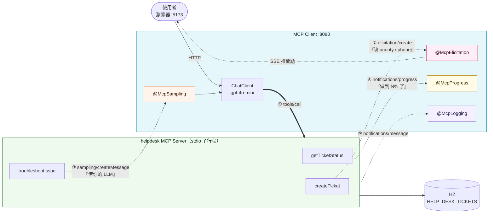

### Elicitation Session 的生命週期

`ElicitationSessionStore` 裡每個 session 就是一個 `CompletableFuture`。它有四種結束方式，而**每一種都對應一個不同的 MCP `ElicitResult.Action`**：

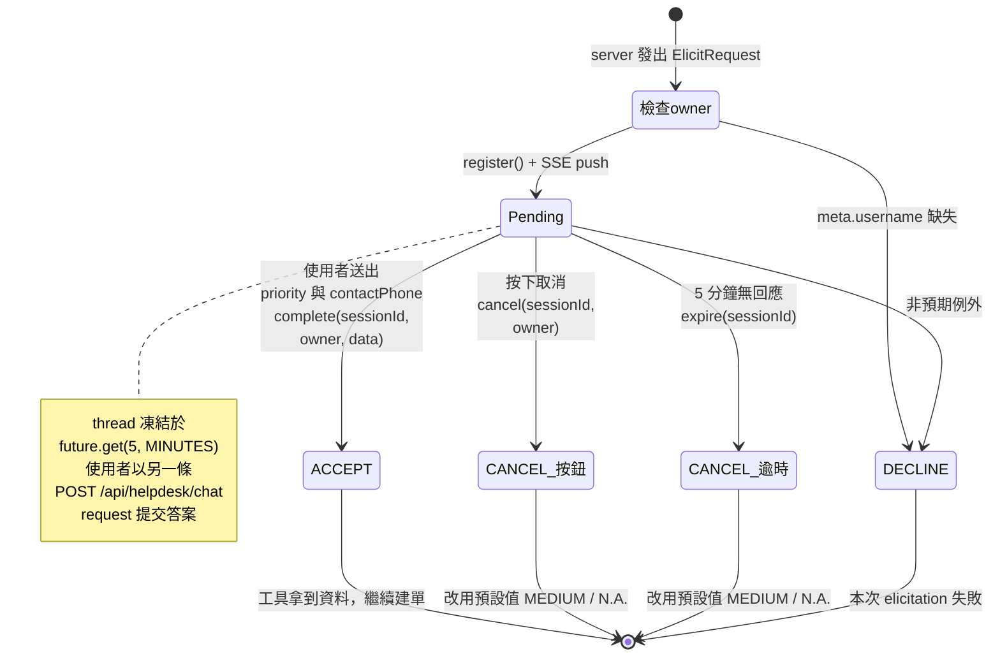

> 📌 `Pending` 時，第一條 thread 停在 `future.get()`。第二條 `POST /api/helpdesk/chat` thread 收到答案並呼叫 `complete()`，再喚醒第一條 thread，讓它把答案回給 MCP server。

### 畫面與 log 實錄

> 以下截圖皆照 [§5 的驗收對話](#5-開啟瀏覽器驗收對話) 實際走一遍拍攝（使用者 `Anthony`，2026-09-24）。

#### 主線：一組對話走完三種能力

**① 起手式** — `http://localhost:5173` 自動導向 `/helpdesk-chat`。右上角先輸入使用者名稱（首次強制，存進 `localStorage` 的 `mcp-username`）。**注意頁首右側的 SSE 指示燈必須是「已連線」** —— 沒接上就送不出訊息，因為 elicitation 的追問只能靠這條通道推回來。

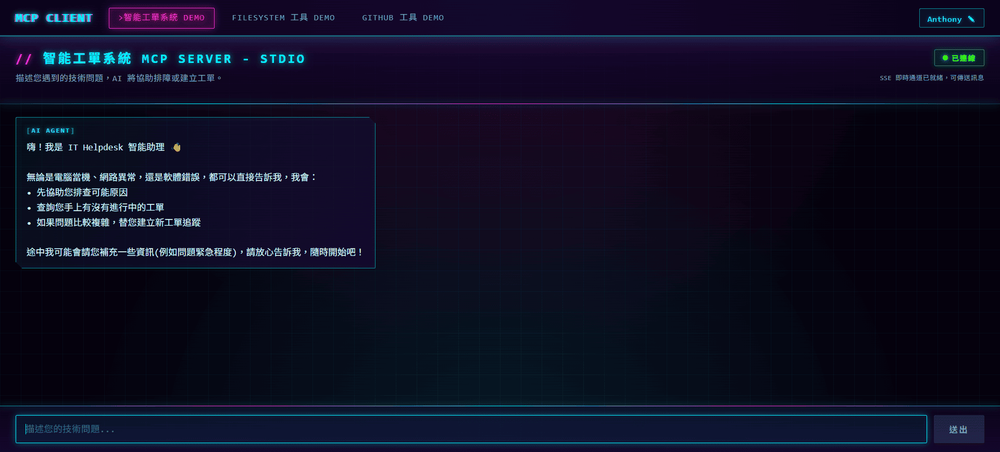

**② Sampling** — 問「我的 Outlook 收不到新郵件，但網頁版可以正常收信」。LLM 呼叫 `troubleshootIssue`，而 server **自己沒有 API key** —— 它把 9 筆 CLOSED 歷史工單組成知識庫，透過 `sampling/createMessage` 借 client 的 LLM 生成建議。

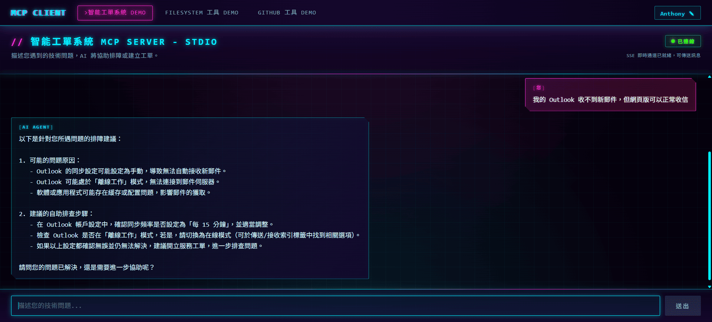

回應裡的「同步頻率改為每 15 分鐘」「確認未處於離線工作模式」並不是 LLM 自由發揮，而是直接對得上 seed 資料中 **David（ID 4）** 那筆 CLOSED 工單的 `RESOLUTION`：

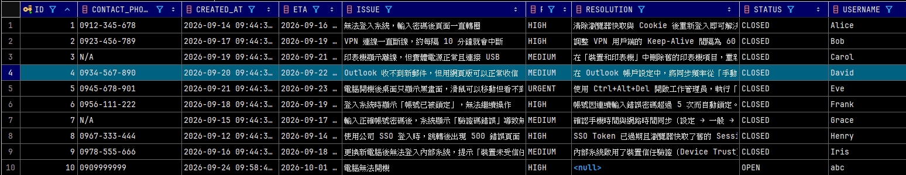

**③ Progress + ④ Elicitation** — 回「試過了還是不行，幫我開單」。LLM 先呼叫 `getTicketStatus` 查既有工單，該工具內含 10 秒的模擬耗時流程，**每秒推一次進度**。畫面上只是在轉圈，但 client 的 terminal 會連續印出 10 行 —— 這是 `@McpProgress` handler 在 `boundedElastic` thread 上收到的；上方兩行 `HelpDeskLogBridge` 的「收到伺服器日誌」則是同一條通道上的 **Logging**：

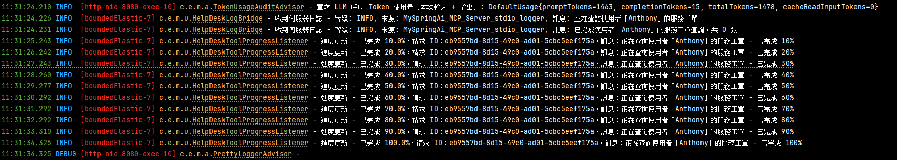

緊接著 LLM 呼叫 `createTicket`，工具執行到一半停住，透過 SSE 把問題推回聊天框。此刻畫面有三個特徵同時成立：⚠️ 追問泡泡出現、**輸入框在 loading 中仍可打字**（placeholder 變成「請回覆上方補充資料的問題...」，即 `allowSendWhileLoading`）、右下角多一顆「取消」鈕。

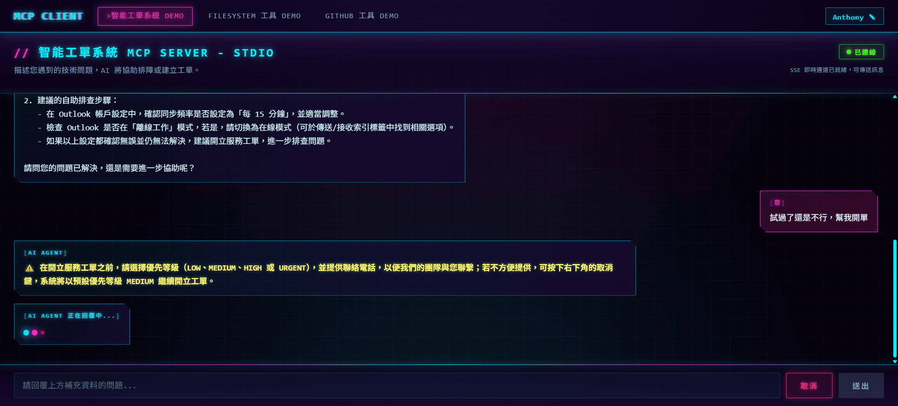

**⑤ 補完資料，工單落地** — 回「HIGH，0912-345-678」。畫面先出現「✅ 資料已收到，正在繼續處理，請稍候...」（這是第二次 POST 的回應），**接著第一次那個還卡著的 POST 才返回**，帶出完整的工單建立成功訊息與工單編號 `#11`。

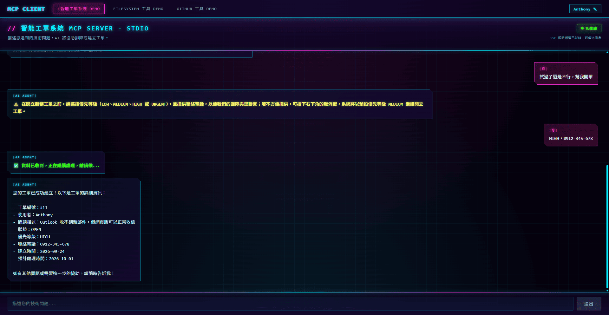

用 DataGrip 或任何 H2 工具連上 `mySpringAi_MCP_Client/h2db/mcpserver_stdio`（`AUTO_SERVER=true` 允許執行中連線）驗證：9 筆 seed 的 CLOSED 工單之後，多了剛才建立的 ID 11 —— `OPEN`、`HIGH`、電話正是 elicitation 補進來的 `0912-345-678`。

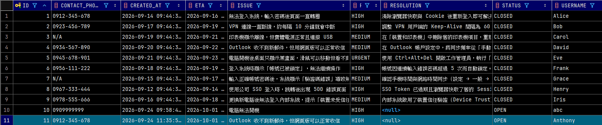

#### 另外兩個 MCP server

**FileSystem 頁** — 只掛 filesystem 工具，授權根目錄是桌面上的 `mymcp`。system prompt 特別交代「`mymcp` 是授權根目錄本身，不是它底下的子資料夾」，並明示不提供刪除。

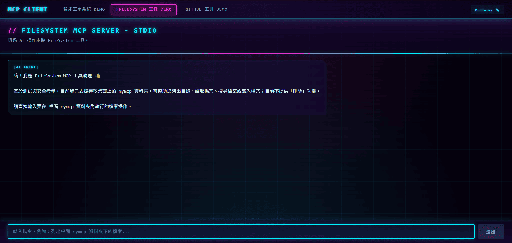

說「新建一個檔案名 helloworld.txt」，LLM 會先反問內容，拿到後再呼叫 filesystem 的寫檔工具：

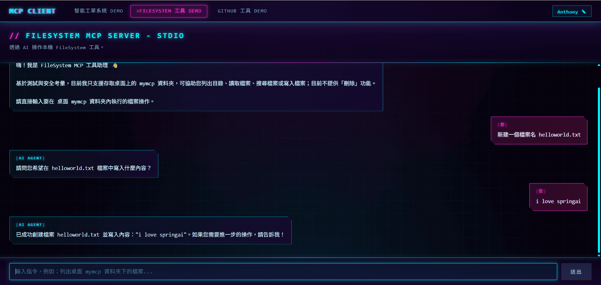

回到桌面 `mymcp` 資料夾，檔案確實落地：

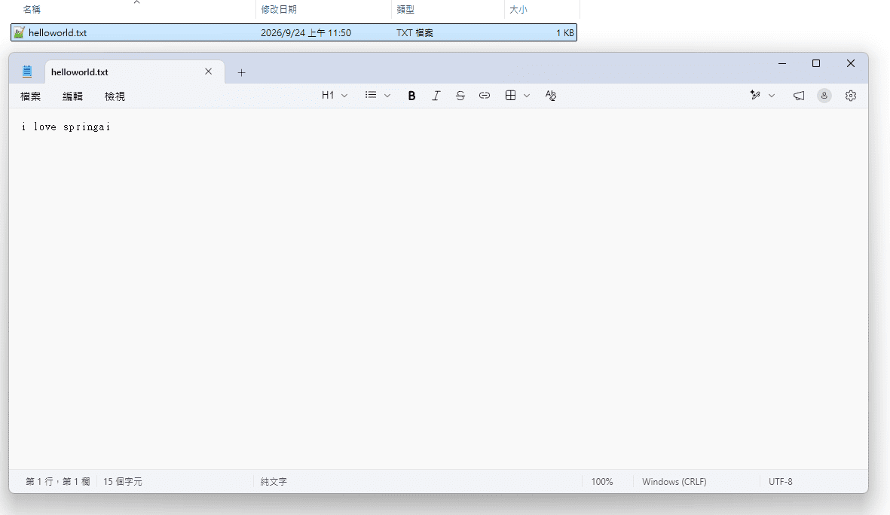

**GitHub 頁** — 只掛 github 工具（docker 起的 `github-mcp-server`），範圍限定在單一 repository。

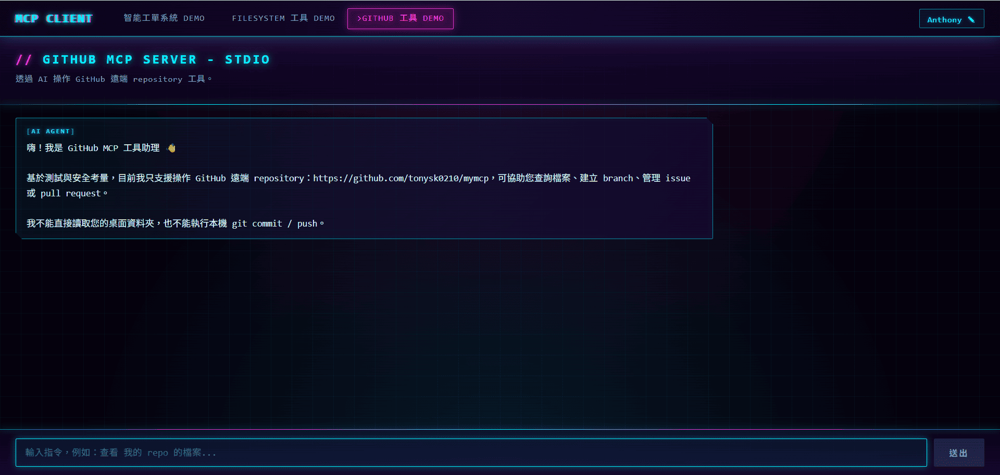

說「查看我的 repo 內容」，LLM 呼叫 github 工具列出 repo 根目錄的檔案與資料夾（含連結與大小）：

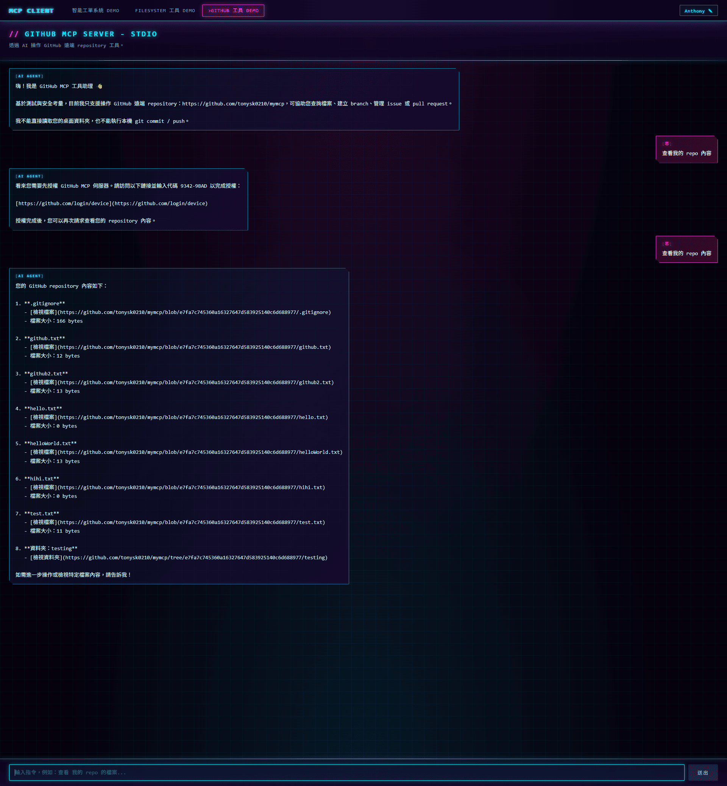

> 截圖中第一次詢問時 LLM 回了一段 GitHub device 授權說明，同一句話重送一次就正常列出內容。本專案以 `GITHUB_PERSONAL_ACCESS_TOKEN` 認證，遇到這種回覆時先確認 token 已設定，再重送即可。

---

## 2. 系統架構與專案結構

### 全景

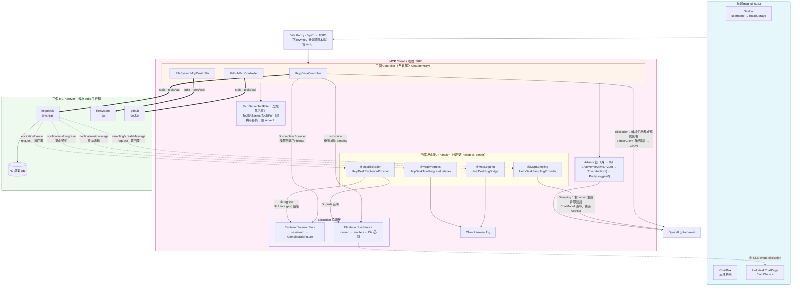

Client 一人分飾兩角：**對前端**是 Web MVC + SSE 後端；**對 MCP** 是 host，負責拉起三個子行程並在它們之間分派工具。

### 兩組長得很像、用途相反的名稱

這是本專案最容易踩錯的地方 —— 同一個 MCP server 有**兩個不同的名字**，各自用在不同 API 上，**不可互換**：

|              | Server 自報名稱                                                                        | Connection key                                                                          |
| ------------ | -------------------------------------------------------------------------------------- | --------------------------------------------------------------------------------------- |
| **值**       | `mySpringAi_MCP_Server_stdio`                                                          | `helpdesk-ticket-mcp-server-stdio`                                                      |
| **來源**     | server 端 `spring.ai.mcp.server.name`                                                  | client 端 properties 的 `...stdio.connections.<這裡>`                                   |
| **從哪讀到** | `client.getServerInfo().name()`                                                        | 設定檔的 key 本身                                                                       |
| **用在**     | `ToolUtil.selectToolsFor(...)` 的 serverName hint<br/>`McpServerToolFilter` 的封鎖比對 | `@McpElicitation(clients = ...)`<br/>`@McpSampling` / `@McpProgress` / `@McpLogging` 同 |

> ⚠️ 填錯不會報錯，只會**靜默失效** —— 工具選不到（0 個 tools），或 handler 永遠不被觸發。

### 三個 Controller 的隔離矩陣

|                                  | `HelpDeskController`            | `FileSystemMcpController` | `GithubMcpController` |
| -------------------------------- | ------------------------------- | ------------------------- | --------------------- |
| 路徑                             | `/api/helpdesk/**`              | `/api/filesystem/chat`    | `/api/github/chat`    |
| 工具 hint                        | `"mySpringAi_MCP_Server_stdio"` | `"filesystem"`            | `"github"`            |
| 獨立 `MessageWindowChatMemory`   | ✅                              | ✅                        | ✅                    |
| 獨立 `PrettyLoggerAdvisor`       | ✅                              | ✅                        | ✅                    |
| `toolContext` 放 `progressToken` | ✅                              | ❌                        | ❌                    |
| 參與 elicitation                 | ✅                              | ❌                        | ❌                    |
| 額外的 `parserClient`            | ✅                              | ❌                        | ❌                    |

三個 controller 的 `chatMemory` 都是各自 `new` 出來的。即使 `username` 相同，helpdesk 的對話歷史也**不會**滲進 filesystem 頁。

### 專案結構（只標關鍵檔案）

```
springai_mcp_clientapp_stdio/
│
├── mySpringAi_MCP_Server_stdio/          MCP Server（stdio）
│   ├── tool/HelpDeskTicketTool.java      ★ 唯一對外接口：3 個 @McpTool，方法刻意 package-private
│   ├── payload/TicketContactInfo.java    ★ elicitation 的 requestedSchema 從這個 record 自動產生
│   ├── config/DataInitializer.java         seed 9 筆 CLOSED 工單 → sampling 的知識庫
│   ├── entity/ · service/ · repo/          JPA 三層
│   └── application.properties            ★ web-application-type=none + root=error（stdio 潔淨）
│
├── mySpringAi_MCP_Client/                MCP Client + REST/SSE 後端
│   ├── MySpringAiMcpClientApplication     ★ 兩段式啟動：run() 前先 setAdditionalProfiles
│   ├── controller/                         三個 controller（見上方隔離矩陣）
│   ├── util/
│   │   ├── HelpDeskElicitationProvider    ★ @McpElicitation — 阻塞 5 分鐘的那一段
│   │   ├── HelpDeskSamplingProvider       ★ @McpSampling — 注入 ChatModel 而非 ChatClient
│   │   ├── HelpDeskToolProgressListener     @McpProgress
│   │   ├── HelpDeskLogBridge                @McpLogging → SLF4J
│   │   ├── ElicitationSessionStore        ★ sessionId → CompletableFuture，owner 驗證
│   │   ├── ElicitationSseService            per-owner emitter + 15 秒心跳
│   │   ├── McpServerToolFilter              全域封鎖（bean）
│   │   └── ToolUtil                         per-request 精選（靜態方法）
│   ├── advisor/                             TokenUsageAudit(-1) · PrettyLogger(0)
│   ├── application-{windows,mac}.properties ★ 平台差異只存在於這兩檔
│   ├── mcp-server-stdio/*.jar             ★ Server 的實體拷貝（非 Maven 依賴！）
│   └── h2db/                                ← H2 檔案實際落在這裡
│
├── mcp-ui/                               React SPA
│   ├── pages/HelpdeskChatPage.jsx        ★ SSE + elicitation，最複雜的一頁
│   ├── components/ChatBox.jsx            ★ 純展示元件，allowSendWhileLoading 是關鍵 prop
│   ├── context/UsernameContext.jsx         → localStorage['mcp-username']
│   └── vite.config.js                      /api → :8080，不 rewrite
│
└── docs/screenshots/                     README 截圖（見 §1 畫面與 log 實錄）
```

> ⚠️ **Server 與 Client 不是 Maven 模組依賴，沒有 parent pom。** Client 是用 `java -jar ./mcp-server-stdio/*.jar` 把 server 當子行程拉起來的 —— 那是一份**實體 JAR 拷貝**（已強制加入版控，儘管根 `.gitignore` 忽略 `*.jar`）。**改了 server 就必須重打包並手動覆蓋**，否則 client 看到的還是舊的 tool schema。

---

## 3. 核心功能與亮點

四種反向能力，**每種都用同一個四拍子拆解**：規格怎麼定義 → Server 怎麼發動 → Client 怎麼接 → 踩到的坑。

| 能力                                                    | 對應工具            | 一句話                                |
| ------------------------------------------------------- | ------------------- | ------------------------------------- |
| [Elicitation](#elicitation--工具執行到一半停下來問人)   | `createTicket`      | 一次 tool call 橫跨兩條 HTTP request  |
| [Sampling](#sampling--server-不持有-api-key-卻能用-llm) | `troubleshootIssue` | 方向反過來，也因此埋了無限迴圈        |
| [Progress](#progress--阻塞與回報在不同-thread-上並行)   | `getTicketStatus`   | 沒有 token 就收不到                   |
| [Logging](#logging--唯一能穿過-stdio-的訊息通道)        | 三者皆有            | stdout 被協定佔用，log 只能走協定本身 |

之後補三則非能力類的設計說明：[stdio 潔淨](#設計說明一stdio-潔淨是整個-server-設定的主軸)、[兩層工具過濾](#設計說明二工具選擇有兩層職責完全不同)、[平台 profile](#設計說明三平台差異被關進-profile-裡)。

---

### Elicitation — 工具執行到一半停下來問人

#### ① 規格怎麼定義

Server 在執行工具期間發出 `elicitation/create`，附上一段說明文字與一份 JSON Schema，要求 client 向使用者收集資料。Client 回 `ACCEPT`（附資料）、`CANCEL` 或 `DECLINE` 三者之一。

#### ② Server 怎麼發動

```java
// HelpDeskTicketTool.createTicket
if (ctx.elicitEnabled()) {                        // 先問 client 支不支援
    StructuredElicitResult<TicketContactInfo> r = ctx.elicit(
            spec -> spec.message("請選擇優先等級（LOW、MEDIUM、HIGH 或 URGENT），並提供聯絡電話…")
                        .meta("username", username),   // ← owner，client 端用它驗證所有權
            TicketContactInfo.class);                  // ← schema 從這個 record 自動產生
    if (r.action() == ACCEPT && r.structuredContent() != null) { /* 覆蓋預設值 */ }
}
// 不支援或使用者取消 → 沿用 MEDIUM / N.A. 繼續建單，不讓流程中斷
```

`requestedSchema` **不是手寫的** —— Spring AI 從 `TicketContactInfo(String priority, String contactPhone)` 的欄位結構自動產生。改這個 record 的欄位，等於改了前端問使用者的問題。

#### ③ Client 怎麼接

難點在於：`@McpElicitation` handler 是**同步方法、必須回傳結果**，但答案要等使用者打字，而且會走**另一條完全獨立的 HTTP request** 進來。`ElicitationSessionStore` 就是這兩條時間軸的會合點。

```java
// Thread A — HelpDeskElicitationProvider，註冊後就地凍結
String sessionId = sessionStore.register(request, owner);
sseService.push(owner, sessionId, request.message(), schema);
Map<String,Object> data = responseFuture.get(5, TimeUnit.MINUTES);   // ← park
return ElicitResult.builder(ACCEPT).content(data).build();

// Thread B — 第二次 POST /chat，解析後喚醒 Thread A
Map<String,Object> data = parserClient.prompt().user(...).call().entity(Map.class);
sessionStore.complete(pending.sessionId(), username, data);           // ← unpark
return "✅ 資料已收到，正在繼續處理，請稍候...";
```

#### ④ 踩到的坑

| 坑                                   | 後果                                                                                   | 防法                                                                                  |
| ------------------------------------ | -------------------------------------------------------------------------------------- | ------------------------------------------------------------------------------------- |
| `parserClient` 重用了主 `chatClient` | 「自然語言 → JSON」這步**自己觸發巢狀 tool call**，而它正被一個未完成的 tool call 包著 | `ChatClient.Builder` 是 prototype scope，constructor 注入兩個參數就會拿到兩個獨立實例 |
| 三處超時沒對齊                       | 使用者還在打字，協定層先掐斷                                                           | client `request-timeout` / server JAR 的 `-D` 參數 / `future.get(...)` **都是 300s**  |
| `meta.username` 缺失                 | 無法驗證所有權                                                                         | 直接回 `DECLINE`；`complete()` 與 `cancel()` 都做 `sessionId + owner` 雙重驗證        |
| 使用者中途按 F5                      | SSE 重連後提示消失，server 白等 5 分鐘                                                 | 訂閱時 replay `pendingForOwner()`；前端用 `seenElicitationSessionsRef` 去重           |

取消走的是**獨立端點** `POST /elicitation/{sessionId}/cancel`（`future.cancel(true)` → handler 收到 `CancellationException` → 回 `CANCEL`）。明確的取消不需要 LLM 解析，沒理由再燒一次 token。

---

### Sampling — Server 不持有 API key 卻能用 LLM

#### ① 規格怎麼定義

Server 發出 `sampling/createMessage`，把一次 LLM 補全請求**委託回 client 執行**。好處是 server 可以是任何人寫的任何東西，你都不必信任它、也不必給它金鑰。

#### ② Server 怎麼發動

```java
// HelpDeskTicketTool.troubleshootIssue
if (!ctx.sampleEnabled()) return "很抱歉，目前 AI 自助排障功能無法使用…";

String knowledgeBase = resolvedTickets.stream()          // status=CLOSED 且有 resolution
        .map(t -> "問題：" + t.getIssue() + " | 解決方式：" + t.getResolution())
        .collect(joining("\n"));

McpSchema.CreateMessageResult result = ctx.sample(spec -> spec
        .systemPrompt(systemPrompt)                       // 見下方三條約束
        .message("使用者遇到的問題：" + issue + "\n\n歷史解決案例參考：\n" + knowledgeBase));
```

system prompt 裡最關鍵的是第三條約束：

```
- 若歷史解決案例中有相關資訊，請優先引導使用者依照歷史解決方案自行排除…
- 若找不到相關資訊，請直接回覆：「目前歷史紀錄中無相關解決案例，建議您開立服務工單…」
- 禁止提供歷史案例以外的通用建議或自行推測解法。
```

**沒有第三條，LLM 會憑訓練資料編出一套看似合理的排障步驟**，而使用者分不出哪些來自公司實際案例、哪些是模型幻想。

#### ③ Client 怎麼接

```java
@McpSampling(clients = "helpdesk-ticket-mcp-server-stdio")
public McpSchema.CreateMessageResult handleSamplingRequest(McpSchema.CreateMessageRequest request) {
    List<Message> messages = new ArrayList<>();
    if (request.systemPrompt() != null) messages.add(new SystemMessage(request.systemPrompt()));
    messages.add(new UserMessage(/* 篩 role=USER 且為 TextContent 的訊息合併 */));

    ChatResponse response = chatModel.call(new Prompt(messages));   // ← ChatModel，不是 ChatClient
    return CreateMessageResult.builder(ASSISTANT, generatedText, model).build();
}
```

#### ④ 踩到的坑

**注入的必須是 `ChatModel`，不能是 `ChatClient`。** `ChatClient` 透過 `defaultTools()` 綁了 MCP tools —— 用它的話，sampling 產生的回應可能又觸發一次 tool call，而那個 tool 自己可能又發起 sampling：

```
tool → sample → LLM(帶工具) → tool call → tool → sample → …
```

`ChatModel` 是不帶任何工具的純 LLM 呼叫層，直接切斷這條迴路。這是整個機制唯一的結構性陷阱，而且**症狀是 token 暴衝而非報錯**。

---

### Progress — 阻塞與回報在不同 thread 上並行

#### ① 規格怎麼定義

Client 在 tool call 時附上一個 `progressToken`；server 執行期間可多次發 `notifications/progress`，每次帶同一個 token，讓 client 對應得回是哪一次呼叫。

#### ② Server 怎麼發動

```java
// HelpDeskTicketTool.getTicketStatus — 模擬耗時流程
for (int i = 0; i < 10; i++) {
    Thread.sleep(1000);
    int percent = (i + 1) * 100 / 10;
    ctx.progress(spec -> spec.progress(percent).message("…已完成 " + percent + "%"));
}
```

#### ③ Client 怎麼接

```java
// 送出端：只有 HelpDeskController 放了 token
.toolContext(Map.of("progressToken", UUID.randomUUID().toString()))

// 接收端
@McpProgress(clients = "helpdesk-ticket-mcp-server-stdio")
public void onProgress(McpSchema.ProgressNotification n) {
    log.info("進度更新 - 已完成 {}%，請求 ID：{}，訊息：{}", n.progress(), n.progressToken(), n.message());
}
```

#### ④ 踩到的坑

**`onProgress()` 與 `.call().content()` 跑在不同 thread 上。** 業務 thread 阻塞等 tool 完成的同時，notification thread 每秒被呼叫一次印 log —— 兩者並行。若誤以為是同一條，會寫出「在 onProgress 裡更新 request scope 狀態」這種行不通的程式碼。

另外，**沒放 `progressToken` 的 controller 收不到任何進度**。filesystem 與 github 兩個端點目前都沒放；日後若要接進度回報，記得補上。

---

### Logging — 唯一能穿過 stdio 的訊息通道

#### ① 規格怎麼定義

Server 發 `notifications/message`（含 `level` / `logger` / `data` 三欄），client 自行決定怎麼呈現。

#### ② Server 怎麼發動

```java
private void info(McpSyncRequestContext ctx, String message) {
    ctx.log(spec -> spec.level(McpSchema.LoggingLevel.INFO)
                        .logger("MySpringAi_MCP_Server_stdio_logger")
                        .message(message));
}
```

三個工具的每個關鍵步驟都同時呼叫 `log.info(...)`（本地）與 `info(ctx, ...)`（送 client）。

#### ③ Client 怎麼接

```java
@McpLogging(clients = "helpdesk-ticket-mcp-server-stdio")
public void onServerLog(McpSchema.LoggingLevel level, String source, String message) {
    log.info("收到伺服器日誌 - 等級: {}, 來源: {}, 訊息: {}", level, source, message);
}
```

#### ④ 踩到的坑

`clients` 要填 **connection key**（`helpdesk-ticket-mcp-server-stdio`），不是 server 自報的 `mySpringAi_MCP_Server_stdio`。四個 `@Mcp*` annotation 都是這個規則，而 `ToolUtil` 的規則**正好相反** —— 見 [兩組長得很像、用途相反的名稱](#兩組長得很像用途相反的名稱)。

更根本的是：**server 是 stdio 子行程，它的 stdout 已經被 JSON-RPC 佔用了**。你在 client console 上看到的所有 server 訊息，全部是這樣繞過 stdout 過來的 —— 這不是「順便做的可觀測性」，而是唯一可行的通道。

---

### 設計說明（一）：stdio 潔淨是整個 Server 設定的主軸

MCP over stdio 表示 **stdin/stdout 就是傳輸層**。任何多印一行的 `System.out.println`、任何走預設 `ConsoleAppender` 的 log，都會被 client 當成畸形的協定訊息。

而 Spring Boot 的預設行為恰恰相反 —— 開機就往 stdout 噴 banner 與數十行啟動 log。Server 的 `application.properties` 因此整份都在做同一件事：

| 設定                                    | 作用                                               |
| --------------------------------------- | -------------------------------------------------- |
| `spring.main.web-application-type=none` | 不啟動 embedded Tomcat（不需要，也少一批啟動 log） |
| `logging.level.root=error`              | 壓掉 INFO/DEBUG/WARN 的啟動洪流                    |
| `spring.main.banner-mode=off`           | 關掉 ASCII banner                                  |

> ⚠️ Server **沒有** 自訂的 `logback-spring.xml` —— 潔淨完全倚賴上述三個 property。這代表 **ERROR 等級的 log 仍會走預設 appender 印到 stdout**。子專案的 `CLAUDE.md` 與舊版 `README.txt` 稱「logback 已導向 `System.err`」，但該設定檔目前並不存在。要補強的話，應新增 logback 設定把 `ConsoleAppender` 的 `target` 設為 `System.err`。

### 設計說明（二）：工具選擇有兩層，職責完全不同

三個 MCP server 加起來工具數量可觀（光 github 就數十個）。全丟給 LLM 會造成 prompt 膨脹，也可能讓 LLM 在 filesystem 頁誤用 github 工具。兩層機制各司其職，**別混為一談**：

|      | `McpServerToolFilter`                                                | `ToolUtil.selectToolsFor()`                 |
| ---- | -------------------------------------------------------------------- | ------------------------------------------- |
| 形式 | Spring bean（實作 `McpToolFilter`）                                  | 靜態 helper 方法                            |
| 範圍 | **全域**，影響所有 request                                           | **單次**，只影響呼叫處                      |
| 時機 | lazy — 首次 LLM request 時執行並快取，僅 `McpToolsChangedEvent` 重跑 | 各 controller 的 constructor 呼叫一次並快取 |
| 設定 | `application.properties` 的 `mcp.tool-filter.blocked-*`              | 程式碼中的 server / tool hint               |
| 比對 | server 名稱 `contains` ／ tool 名稱 `startsWith`                     | 兩者皆 `contains`（不分大小寫）             |
| 語意 | 「這個工具**誰都不准**用」                                           | 「這個端點**只看得到**這些工具」            |

`blocked-servers` 與 `blocked-tool-prefixes` 目前都留空（全放行），保留設定點方便隨時封鎖 —— 例如把 `write_`、`delete_` 加進前綴清單，就能在**不動任何 Java 程式碼**的情況下讓所有寫入類工具消失。

`ToolUtil` 每開放一個工具就 `log.info` 一行、最後印總數。**這是啟動時唯一能確認「每個 controller 實際拿到哪些工具」的手段**，在 MCP server 換版或工具改名時特別重要。

### 設計說明（三）：平台差異被關進 profile 裡

Windows 的 `npx` 是 `.cmd` script，`ProcessBuilder` 無法直接執行，必須 `cmd /c` 包起來；但 `docker` 與 `java` 是真正的 `.exe`，不需要也不能包。沒有優雅的跨平台寫法，只能分檔：

```properties
# windows：command=cmd,  args = [/c, npx, -y, @modelcontextprotocol/server-filesystem, <root>]
# mac    ：command=npx,  args = [-y, @modelcontextprotocol/server-filesystem, <root>]
```

因此 `main()` 刻意寫成兩段式 —— 先判斷 `os.name`，在 `run()` **之前**呼叫 `setAdditionalProfiles(...)`：

```java
SpringApplication app = new SpringApplication(MySpringAiMcpClientApplication.class);
String os = System.getProperty("os.name").toLowerCase();
if (os.contains("windows"))  app.setAdditionalProfiles("windows");
else if (os.contains("mac")) app.setAdditionalProfiles("mac");
app.run(args);
```

**若重構成單純的 `SpringApplication.run(...)`，MCP 連線設定會是空的 —— 而且不會拋例外。** App 正常啟動，只是一個 MCP server 都沒連上，所有 controller 拿到空工具陣列，LLM 則禮貌地回答「我沒有這個能力」。這是最難查的那種失敗。

---

## 4. 技術棧

### Server — `mySpringAi_MCP_Server_stdio`

| 項目        | 版本／artifact                        | 備註                                                                                                                                            |
| ----------- | ------------------------------------- | ----------------------------------------------------------------------------------------------------------------------------------------------- |
| Java        | **25**                                | `pom.xml` 的 `java.version`                                                                                                                     |
| Spring Boot | **4.1.0**                             | `spring-boot-starter-parent`                                                                                                                    |
| Spring AI   | **2.0.0**                             | 由 `spring-ai-bom` 匯入                                                                                                                         |
| MCP         | `spring-ai-starter-mcp-server`        | ⚠️ **stdio 方向** —— client 啟動你的 Java process，走 stdin/stdout。若要當 HTTP server 供遠端連線，需改用 `spring-ai-starter-mcp-server-webmvc` |
| 持久化      | `spring-boot-starter-data-jpa` + `h2` | 檔案式 DB，`AUTO_SERVER=true`                                                                                                                   |
| H2 Console  | `spring-boot-h2console`               | ⚠️ Boot 4 起被抽成獨立模組，但本專案 `web-application-type=none` 讓它**不會啟動**                                                               |
| Web         | `spring-boot-starter-webmvc`          | ⚠️ 同上，被 `none` 抵銷，屬未生效依賴                                                                                                           |

### Client — `mySpringAi_MCP_Client`

| 項目                    | 版本／artifact                                   | 備註                                                              |
| ----------------------- | ------------------------------------------------ | ----------------------------------------------------------------- |
| Java / Boot / Spring AI | 同 Server（**25 / 4.1.0 / 2.0.0**）              | 兩份 pom 必須鎖同版號                                             |
| MCP                     | `spring-ai-starter-mcp-client`                   | 成為 MCP host，把多個 server 的 tools 轉成 `ToolCallbackProvider` |
| LLM                     | `spring-ai-starter-model-openai` · `gpt-4o-mini` | ⚠️ 設定 key 是 `chat.model`，**不是** `chat.options.model`        |
| Web + SSE               | `spring-boot-starter-webmvc`                     | Boot 4 的新命名（不再是 `-web`）；`SseEmitter` 走同步 MVC         |
| 排程                    | `@EnableScheduling`                              | SSE 的 15 秒心跳靠它                                              |
| 測試                    | `spring-boot-starter-webmvc-test`                | 9 個 `@Test`，見 [測試覆蓋](#測試覆蓋)                            |

> ⚠️ **升級 Spring AI 必須兩邊一起動。** `@McpElicitation` / `@McpSampling` / `@McpLogging` / `@McpProgress` 的 API 表面在不同 milestone 間變動過（例如 `ElicitRequest` 拆成 `ElicitFormRequest` / `ElicitUrlRequest`）。只升一邊，錯誤會在 runtime 才浮現。

### 三個 MCP Server

| Connection key                     | 形態                       | 平台差異               | 需要的環境           |
| ---------------------------------- | -------------------------- | ---------------------- | -------------------- |
| `helpdesk-ticket-mcp-server-stdio` | 自製 Spring Boot JAR       | 無                     | JDK 25               |
| `filesystem`                       | npm 套件（`npx` 即時下載） | ⚠️ Windows 需 `cmd /c` | Node.js 20+          |
| `github`                           | Docker image               | 無                     | Docker Desktop + PAT |

### 前端 — `mcp-ui`

| 技術         | 版本       | 實際用法                                                                     |
| ------------ | ---------- | ---------------------------------------------------------------------------- |
| React        | 19.2       | 全函數元件 + Hooks，3 個頁面                                                 |
| Vite         | 8.1        | `:5173`；`/api` proxy 至 `:8080`，**不 rewrite**                             |
| React Router | 7.18       | 3 條路由，`/` → `/helpdesk-chat`                                             |
| Axios        | 1.18       | 單一實例，`baseURL: /api`                                                    |
| EventSource  | 瀏覽器原生 | SSE 長連線，非第三方套件                                                     |
| ESLint       | 10.6       | flat config，`react-hooks` + `react-refresh`                                 |
| 狀態管理     | —          | React Context → `localStorage`，**無 Redux**                                 |
| 樣式         | —          | 原生 CSS 變數，Cyberpunk 主題（`#05010d` / `#00f0ff` / `#ff2bd6`），等寬字體 |

> ⚠️ 前端**無測試框架**（無 vitest／jest），`npm test` 不存在。

---

## 5. 快速開始與本地部署

### 環境需求

|                    | 用途                              | 缺了會怎樣                 |
| ------------------ | --------------------------------- | -------------------------- |
| **JDK 25**         | Server 與 Client                  | 無法編譯                   |
| **Node.js 20+**    | 前端 + filesystem server 的 `npx` | filesystem 頁失效          |
| **Docker Desktop** | github MCP server                 | github 頁失效              |
| **OpenAI API Key** | 所有聊天端點                      | app 照常啟動，呼叫時才失敗 |
| GitHub PAT         | 僅 github 頁                      | 該頁失效                   |
| Maven              | —                                 | 已內建 wrapper，不需另裝   |

選用：**MCP Inspector**（單獨測 server）、**DataGrip / H2 工具**（看工單資料）。

### 環境變數

| 變數                           | 必要           | 說明                                                                                |
| ------------------------------ | -------------- | ----------------------------------------------------------------------------------- |
| `OPENAI_API_KEY`               | ✅             | 以 `${OPENAI_API_KEY:}` 讀取，**未設定時 app 仍正常啟動**                           |
| `GITHUB_PERSONAL_ACCESS_TOKEN` | 若用 github 頁 | Docker `-e` 帶入 container                                                          |
| `MCP_FILESYSTEM_ROOT`          | ❌             | 未設定則 fallback 到 Windows `%USERPROFILE%\Desktop\mymcp`／macOS `~/Desktop/mymcp` |

```powershell
# Windows PowerShell
$env:OPENAI_API_KEY = "sk-..."
$env:GITHUB_PERSONAL_ACCESS_TOKEN = "ghp_..."
$env:MCP_FILESYSTEM_ROOT = "C:\path\to\mcp\root"
```

```bash
# macOS
export OPENAI_API_KEY="sk-..."
export GITHUB_PERSONAL_ACCESS_TOKEN="ghp_..."
export MCP_FILESYSTEM_ROOT="$HOME/Desktop/mymcp"
```

> 所有密鑰一律走環境變數，切勿寫死於 properties 或提交進版控。

### 1. 啟動 Docker Desktop

Client 啟動時會 `docker run` 拉起 github MCP server。**Docker 必須先處於 Engine running 狀態**，否則該 server 連不上（其他兩頁不受影響）。驗證：`docker version` 看得到 Client / Server 版本。

### 2. 打包並覆蓋 Server JAR（**只在動過 Server 時需要**）

```powershell
# Windows PowerShell
cd mySpringAi_MCP_Server_stdio
.\mvnw.cmd clean package -DskipTests
Copy-Item target\mySpringAi_MCP_Server_stdio-0.0.1-SNAPSHOT.jar `
          ..\mySpringAi_MCP_Client\mcp-server-stdio\ -Force
```

```bash
# macOS
cd mySpringAi_MCP_Server_stdio
./mvnw clean package -DskipTests
cp target/mySpringAi_MCP_Server_stdio-0.0.1-SNAPSHOT.jar \
   ../mySpringAi_MCP_Client/mcp-server-stdio/
```

> 📌 Repo 已內附預打包 JAR，首次 clone 可直接跳到第 3 步。

### 3. 啟動 Client（會自動拉起三個 MCP server 子行程）

```powershell
# Windows PowerShell
cd mySpringAi_MCP_Client
.\mvnw.cmd spring-boot:run "-Dspring-boot.run.profiles=windows"
```

```bash
# macOS
cd mySpringAi_MCP_Client
./mvnw spring-boot:run -Dspring-boot.run.profiles=mac
```

**啟動 log 是最好的驗收點**：

```
ToolUtil - MCP tool 已開放：server='mySpringAi_MCP_Server_stdio' tool='createTicket'
ToolUtil - MCP tool 已開放：server='mySpringAi_MCP_Server_stdio' tool='getTicketStatus'
ToolUtil - MCP tool 已開放：server='mySpringAi_MCP_Server_stdio' tool='troubleshootIssue'
ToolUtil.selectToolsFor(serverName='mySpringAi_MCP_Server_stdio', toolName='null') 共開放 3 個 tools
```

三個 controller 各印一段。**哪一段是「共開放 0 個 tools」，就是那個 server 沒連上** → 對照 [疑難排解](#疑難排解)。

> 📌 profile 也會由 `main()` 依 `os.name` 自動選，但顯式指定較可靠（尤其在 IDE Run Configuration 裡）。

### 4. 啟動前端

```bash
cd mcp-ui
npm install     # 首次或依賴變動時
npm run dev
```

### 5. 開啟瀏覽器：驗收對話

<http://localhost:5173> → 自動導向 `/helpdesk-chat`。**先在右上角輸入使用者名稱**，等指示燈轉為「已連線」。

下面這組對話**依序走完三種反向能力**，同時也是 [§1 畫面與 log 實錄](#畫面與-log-實錄) 的拍攝腳本：

| #   | 你輸入                                          | 觸發                                                                    | 你該看到                                                                                       | 對應截圖                                        |
| --- | ----------------------------------------------- | ----------------------------------------------------------------------- | ---------------------------------------------------------------------------------------------- | ----------------------------------------------- |
| 1   | 我的 Outlook 收不到新郵件，但網頁版可以正常收信 | `troubleshootIssue` → **Sampling**                                      | 對得上 seed 資料 David 那筆的排障步驟                                                          | `toubleshootissue.png`、`sampling-david-db.png` |
| 2   | 試過了還是不行，幫我開單                        | `getTicketStatus` → **Progress**，接著 `createTicket` → **Elicitation** | terminal 連續 10 行 `進度更新 - 已完成 N%`（約 10 秒），隨後 ⚠️ 追問泡泡 + 輸入框解鎖 + 取消鈕 | `client-terminal.png`、`elicitation.png`        |
| 3   | HIGH，0912-345-678                              | elicitation 完成                                                        | 「✅ 資料已收到」→ 隨後工單建立成功（含編號）                                                  | `complete-ticket.png`、`ticket-created-db.png`  |

> 若 LLM 在第 2 步只查了工單、先問你「是否要開單」而沒直接呼叫 `createTicket`，回一句「確認開單」即可觸發 elicitation。

**Logging** 則貫穿全程 —— 每一步的 terminal 都會出現 `收到伺服器日誌 - 等級: INFO, 來源: MySpringAi_MCP_Server_stdio_logger, 訊息: …`。

### 其他常用指令

```powershell
# Server
cd mySpringAi_MCP_Server_stdio
.\mvnw.cmd clean test
.\mvnw.cmd clean package -DskipTests

# Client
cd mySpringAi_MCP_Client
.\mvnw.cmd clean test
.\mvnw.cmd -Dtest=ElicitationSessionStoreTest test     # 單一測試類別
.\mvnw.cmd package                                     # → target/*.jar

# Frontend
cd mcp-ui
npm run lint          # ESLint（無單元測試）
npm run build         # → dist/
npm run preview
```

---

## 6. 附錄

### Client 對外 API

所有請求皆需帶 header `username: <任意識別字串>` —— 它同時是 chat memory 的 `conversationId`、SSE 連線的 owner、以及 elicitation session 的所有權憑據。

> 📌 前端走 Vite proxy 時路徑不變（`/api/helpdesk/chat`）—— 本專案的 proxy **不做 rewrite**，後端 `@RequestMapping` 本身就含 `/api`。curl / Postman 直打後端時路徑完全相同。

| Method | Path                                               | Body                      | 說明                                                                                                       |
| ------ | -------------------------------------------------- | ------------------------- | ---------------------------------------------------------------------------------------------------------- |
| `POST` | `/api/helpdesk/chat`                               | `{ message, sessionId? }` | `sessionId` 僅在回覆 elicitation 時帶。若該 username 有 pending session 卻沒帶，會被擋下並提示先完成或取消 |
| `GET`  | `/api/helpdesk/elicitation/stream?username=<name>` | —                         | **SSE**。訂閱後平時沉默；訂閱當下會 replay 該 owner 的 pending session                                     |
| `POST` | `/api/helpdesk/elicitation/{sessionId}/cancel`     | —                         | `future.cancel(true)` → 回 `CANCEL` 給 server → server 改用預設值繼續建單                                  |
| `POST` | `/api/filesystem/chat`                             | `{ message }`             | 只掛 filesystem 工具                                                                                       |
| `POST` | `/api/github/chat`                                 | `{ message }`             | 只掛 github 工具                                                                                           |

三個端點共用同一個 record `ChatPayload { message, sessionId }`（後兩者不使用 `sessionId`）。回應皆為純文字 `String`，非 JSON 包裝。

### MCP Tool 總表（helpdesk server）

| Tool                | 參數                | 反向能力        | 行為                                                                                                                                         |
| ------------------- | ------------------- | --------------- | -------------------------------------------------------------------------------------------------------------------------------------------- |
| `createTicket`      | `issue`, `username` | **Elicitation** | 先 `ctx.elicitEnabled()` 判斷；收集 `priority` + `contactPhone`，不支援或取消則退回 `MEDIUM` / `N/A`。寫入 H2（`status=OPEN`、`eta=now+7d`） |
| `getTicketStatus`   | `username`          | **Progress**    | 查該使用者所有工單，並在 10 次迴圈中每秒 `ctx.progress()` 一次（10%→100%）                                                                   |
| `troubleshootIssue` | `issue`, `username` | **Sampling**    | 先 `ctx.sampleEnabled()` 判斷；撈 `status=CLOSED` 且有 `resolution` 的工單組知識庫                                                           |

三者都用 `info(ctx, msg)` helper 同時發 `ctx.log()` 與本地 `log.info()`。方法刻意宣告為 **package-private** —— 它們由 Spring AI 透過 reflection 呼叫，不該被其他 Java 程式碼直接使用。

### Elicitation SSE 事件格式

```
event: elicitation
data: {
  "sessionId": "a3f2c1d0-...",
  "prompt":    "在開立服務工單之前，請選擇優先等級（LOW、MEDIUM、HIGH 或 URGENT）...",
  "schema": {
    "type": "object",
    "properties": {
      "priority":     { "type": "string" },
      "contactPhone": { "type": "string" }
    }
  }
}
```

若 server 送的是 `ElicitUrlRequest`（URL 模式而非表單模式），`schema` 會是空 `{}`。

### 主要設定項

**Server**

| Property                           | 值                                                     | 說明                                              |
| ---------------------------------- | ------------------------------------------------------ | ------------------------------------------------- |
| `spring.ai.mcp.server.name`        | `mySpringAi_MCP_Server_stdio`                          | ⚠️ `ToolUtil` 比對的就是這個，不是 connection key |
| `spring.main.web-application-type` | `none`                                                 | 不啟動 Tomcat                                     |
| `logging.level.root`               | `error`                                                | stdout 潔淨                                       |
| `spring.main.banner-mode`          | `off`                                                  | 同上                                              |
| `spring.datasource.url`            | `jdbc:h2:file:./h2db/mcpserver_stdio;AUTO_SERVER=true` | **相對路徑 —— 落點取決於啟動時的工作目錄**        |
| `spring.jpa.hibernate.ddl-auto`    | `update`                                               | 本地開發用                                        |

**Client**

| Property                                          | 值            | 說明                                                                                                     |
| ------------------------------------------------- | ------------- | -------------------------------------------------------------------------------------------------------- |
| `spring.ai.openai.chat.model`                     | `gpt-4o-mini` | ⚠️ 是 `chat.model`，**不是** `chat.options.model`                                                        |
| `spring.ai.mcp.client.request-timeout`            | `300s`        | ⚠️ 需與 server JAR 的 `-Dspring.ai.mcp.server.request-timeout=300s` 及 `future.get(5, MINUTES)` 三處對齊 |
| `...stdio.connections.<key>.command` / `.args[n]` | 見 profile 檔 | ⚠️ `<key>` 就是四個 `@Mcp*` annotation 的 `clients` 值                                                   |
| `mcp.tool-filter.blocked-servers`                 | _（空）_      | `contains` 比對，命中則該 server 全部工具封鎖                                                            |
| `mcp.tool-filter.blocked-tool-prefixes`           | _（空）_      | `startsWith` 比對，僅封鎖該 tool                                                                         |
| `logging.level.…PrettyLoggerAdvisor`              | `DEBUG`       | 不設 DEBUG 就看不到格式化的 prompt／回應                                                                 |

### 測試覆蓋

全 repo 共 **9 個 `@Test`**。值得注意的是：**elicitation 的跨使用者隔離與冪等性是有測試保護的**。

| 測試類別                                   | 數量 | 實際驗證什麼                                                                                                                                                                                                                                          |
| ------------------------------------------ | ---- | ----------------------------------------------------------------------------------------------------------------------------------------------------------------------------------------------------------------------------------------------------- |
| `ElicitationSessionStoreTest`              | 3    | ① Bob 無法 cancel Annie 的 session；cancel 後 future 拋 `CancellationException`；重複 cancel 回 false<br/>② Bob 無法 complete Annie 的 session；complete 後不可再 cancel<br/>③ `pendingForOwner` 只回該 owner 的；`findPending` 跨 owner 查詢回 empty |
| `HelpDeskElicitationProviderTest`          | 3    | future 被取消 → `CANCEL`；future 已完成 → `ACCEPT` + 資料；缺 `meta.username` → `DECLINE` 且**完全不碰 SSE 與 sessionStore**                                                                                                                          |
| `HelpDeskControllerTest`                   | 1    | cancel 端點的 404（錯 owner）→ 200（首次）→ 404（重複）序列                                                                                                                                                                                           |
| `MySpringAiMcpClientApplicationTests`      | 1    | `contextLoads`                                                                                                                                                                                                                                        |
| `MySpringAiMcpServerStdioApplicationTests` | 1    | `contextLoads`                                                                                                                                                                                                                                        |

> ⚠️ **`MySpringAiMcpClientApplicationTests` 是 `@SpringBootTest`** —— 它會真的啟動完整 context，也就是真的去 spawn 三個 MCP stdio 子行程。**沒有 Docker / Node 環境時，`mvnw test` 會失敗或掛住**。要跑純單元測試請指定類別：`.\mvnw.cmd -Dtest=ElicitationSessionStoreTest test`。

### 用 MCP Inspector 單獨測試 Server

不啟動整個 Client 也能手動測 server 的工具：

```powershell
cd mySpringAi_MCP_Server_stdio
.\mvnw.cmd clean package -DskipTests
npx @modelcontextprotocol/inspector
```

| Inspector 欄位 | 值                                                                  |
| -------------- | ------------------------------------------------------------------- |
| Transport      | `stdio`                                                             |
| Command        | `java`                                                              |
| Arguments      | `-jar D:\...\target\mySpringAi_MCP_Server_stdio-0.0.1-SNAPSHOT.jar` |

> 📌 Inspector **支援 elicitation 與 sampling**，會彈出對應的互動介面 —— 這是驗證「server 端能力宣告是否正確」最快的方式，不必牽扯整條 React + SSE 鏈路。

### 資料庫

表名 `HELP_DESK_TICKETS`：

| 欄位                | 型別               | 說明                                     |
| ------------------- | ------------------ | ---------------------------------------- |
| `id`                | `Long`（IDENTITY） | 工單編號                                 |
| `username`          | `String`           | 所屬使用者                               |
| `issue`             | `String`           | 問題描述                                 |
| `status`            | `String`           | `OPEN` ／ `IN_PROGRESS` ／ `CLOSED`      |
| `priority`          | `String`           | **由 elicitation 收集**，預設 `MEDIUM`   |
| `contactPhone`      | `String`           | 同上，未提供則 `N/A`                     |
| `createdAt` / `eta` | `LocalDateTime`    | 建立時間 ／ 預計完成（`createdAt + 7d`） |
| `resolution`        | `String(1000)`     | **`troubleshootIssue` 的知識庫來源**     |

> ⚠️ **H2 檔案的落點取決於誰啟動了 Server。** JDBC URL 是相對路徑 `./h2db/mcpserver_stdio`，而 server 是被 client 以子行程拉起、繼承 client 的工作目錄 —— 所以正常全端啟動時檔案在 **`mySpringAi_MCP_Client/h2db/`**，而非 server 專案目錄下。只有用 Inspector 從 server 目錄直接 `java -jar` 時才會寫到 `mySpringAi_MCP_Server_stdio/h2db/`。**兩種啟動方式看到的是兩份不同的資料。**

| 連線欄位 | 值                                                                                |
| -------- | --------------------------------------------------------------------------------- |
| JDBC URL | `jdbc:h2:file:<repo>/mySpringAi_MCP_Client/h2db/mcpserver_stdio;AUTO_SERVER=TRUE` |
| Driver   | `org.h2.Driver`                                                                   |
| Username | `sa`                                                                              |
| Password | _（留空）_                                                                        |

首次啟動時 `DataInitializer` seed **9 筆 `status=CLOSED` 且含 `resolution` 的工單**（Alice 登入轉圈、Bob VPN 斷線、Carol 印表機離線、David Outlook 收信、Eve 黑畫面、Frank 帳號鎖定、Grace 驗證碼錯誤、Henry SSO 500、Iris 裝置未受信任）。判斷依據是 `findByStatus("CLOSED").isEmpty()` —— **只要庫裡已有任一筆 CLOSED 就跳過 seed**。

### 疑難排解

| 症狀                                | 原因與處理                                                                                                                |
| ----------------------------------- | ------------------------------------------------------------------------------------------------------------------------- |
| 啟動 log 顯示「共開放 0 個 tools」  | 該 MCP server 沒連上，三種來源各有不同原因 ↓                                                                              |
| └ helpdesk 是 0                     | JAR 不存在或路徑錯 —— 確認 `mcp-server-stdio/*.jar` 存在，且 Client 從 `mySpringAi_MCP_Client/` 啟動（args 用相對路徑）   |
| └ filesystem 是 0（Windows）        | `npx` 沒被 `cmd /c` 包住 —— 確認啟用的是 `windows` profile                                                                |
| └ github 是 0                       | Docker 未啟動，或 `GITHUB_PERSONAL_ACCESS_TOKEN` 未設                                                                     |
| └ **三個都是 0**                    | profile 根本沒載入 —— 確認兩段式 `main()` 未被重構掉，或明確帶 `-Dspring-boot.run.profiles=windows`                       |
| 前端「送出」永遠灰的                | 未設 username，或 SSE 指示燈不是「已連線」（helpdesk 頁的 `disabled` 綁定 `sseStatus`）                                   |
| SSE 一直「連線中斷，重試中...」     | 後端未啟動，或 proxy 沒指到 `:8080`。前端每 2 秒重試                                                                      |
| Elicitation 提示沒出現，AI 一直轉圈 | SSE push 時前端還沒訂閱。**重新整理即可** —— 訂閱時後端會 replay `pendingForOwner`                                        |
| Elicitation 回覆後沒反應            | `parserClient` 解析失敗（會回「❌ 無法解析您的輸入」）。session 仍 pending，換更明確的格式重打，例如 `HIGH，0912-345-678` |
| Elicitation 等 5 分鐘自動取消       | `future.get(5, MINUTES)` 逾時 → `CANCEL` → server 用預設值建單。**屬預期行為**                                            |
| 工單查詢要等約 10 秒                | `getTicketStatus` 內含刻意的 `Thread.sleep(1000)` ×10 用來示範 progress。**屬預期行為**                                   |
| Progress log 完全沒出現             | 只有 `HelpDeskController` 放了 `progressToken`，另外兩個端點本來就收不到                                                  |
| Sampling 無限迴圈／token 暴衝       | `@McpSampling` handler 誤用了帶工具的 `ChatClient`，必須改注入 `ChatModel`                                                |
| MCP 通訊出現 JSON parse 錯誤        | server 有東西印到 stdout —— 檢查是否新增了 `System.out.println`，或調高了 `logging.level.root`                            |
| 呼叫端點回 401／金鑰錯誤            | `OPENAI_API_KEY` 未設。預設空字串，**app 仍正常啟動**，呼叫時才失敗                                                       |
| `mvnw test` 失敗或掛住              | `MySpringAiMcpClientApplicationTests` 是 `@SpringBootTest`，會實際 spawn 三個子行程。改用 `-Dtest=<類別>` 跑單元測試      |
| Server 改了程式但行為沒變           | 忘了重打包並覆蓋 `mcp-server-stdio/*.jar`。**兩者不是 Maven 依賴**                                                        |
| 工單資料「消失了」                  | 兩種啟動方式寫到不同的 `h2db/` —— 見上方資料庫警告                                                                        |
| `/h2-console` 連不上                | Server 設了 `web-application-type=none`，**console 不會啟動**。請用 DataGrip 等外部工具直連檔案                           |
| handler 完全不被觸發                | `@Mcp*` 的 `clients` 填成了 server 自報名稱。應填 **connection key**                                                      |

### 已知的刻意取捨

本專案為學習與展示用途，以下**不適用於正式環境**：

- **`username` 只是一個 HTTP header，沒有任何驗證。** 任何人送 `username: Alice` 就能查 Alice 的工單、訂閱 Alice 的 SSE。Session 的 owner 檢查只防「誤配」，不防「冒名」。
- **Server 沒有 `logback-spring.xml`** —— stdout 潔淨僅靠 `logging.level.root=error` + `banner-mode=off`，**ERROR 等級的 log 仍會污染 MCP 通道**。子專案 `CLAUDE.md` 與 `README.txt` 聲稱「已導向 `System.err`」，該設定檔實際不存在。
- **Server pom 的 `spring-boot-starter-webmvc` 與 `spring-boot-h2console` 都被 `web-application-type=none` 抵銷**，`spring.h2.console.enabled=true` 這行同樣空轉。要嘛移除依賴，要嘛別期待 `/h2-console`。
- **`PrettyLoggerAdvisor` 的 `[DOCS]` 區段是死碼** —— 它讀 `context.get("rag_document_context")`，但本 repo 沒有任何 RAG / vector store，永遠不會觸發。屬從姊妹專案 `springai-demo` 帶過來的殘留。
- **`mcp-servers-windows.json` / `mcp-servers-mac.json` 是已停用的殘留檔** —— 兩份 profile 中引用它們的那行已被註解，所有 stdio 設定改為直接寫在 properties。
- **`MySpringAiMcpClientApplicationTests` 會實際啟動三個 MCP 子行程**，使得「單元測試」實質依賴 Docker 與 Node 環境。
- **`spring.jpa.hibernate.ddl-auto=update`** —— Hibernate 自動改 schema，正式環境應改 migration 工具並設 `validate`。
- **H2 使用者 `sa`、密碼為空**，且 `AUTO_SERVER=true` 開放外部連線。
- **Docker image 未鎖版本**（`ghcr.io/github/github-mcp-server` 無 tag），`npx -y` 也是每次抓最新 —— 上游改動可能無預警改變工具清單。
- **`SseEmitter` 逾時設為 `Long.MAX_VALUE`（永不逾時）**，僅靠 15 秒心跳與前端重連維持；連線數無上限。
- **Elicitation session 沒有全域上限或定期清掃**，只在 complete / cancel / 5 分鐘逾時三種情況移除。
- **GitHub PAT 的權限完全取決於使用者自己簽發的 scope。** system prompt 限制「只能操作 `tonysk0210/mymcp`」僅是引導，不是強制 —— 要真正封鎖請縮小 PAT scope 或用 `McpServerToolFilter`。
- **前端無測試框架**；後端 9 個 `@Test` 未涵蓋 elicitation 的端到端流程。
- **`mcp-ui/README.md` 仍是 Vite 官方樣板預設內容**，尚未客製。
- **根目錄 `README.txt` 是舊版純文字快照**，內容已部分過時（特別是 logback 與 h2db 路徑的描述），保留僅供參考。

### 相關文件

| 檔案                                                                                                                                                                                                   | 用途                                        |
| ------------------------------------------------------------------------------------------------------------------------------------------------------------------------------------------------------ | ------------------------------------------- |
| [`CLAUDE.md`](./CLAUDE.md)                                                                                                                                                                             | 跨專案總覽（Claude Code 用）                |
| [`mySpringAi_MCP_Server_stdio/CLAUDE.md`](./mySpringAi_MCP_Server_stdio/CLAUDE.md) · [`mySpringAi_MCP_Client/CLAUDE.md`](./mySpringAi_MCP_Client/CLAUDE.md) · [`mcp-ui/CLAUDE.md`](./mcp-ui/CLAUDE.md) | 各層架構細節                                |
| [`AGENTS.md`](./AGENTS.md) 及各子專案的 `AGENTS.md`                                                                                                                                                    | commit / PR / 測試規範（Codex 等 agent 用） |
